<div class="extraswell">
<button data-toggle="collapse" class="btn btn-link" data-target="#pres">View Presentation </button> [Open presentation in a new tab](presentations/PS_06_raster.html){target="_blank"}
<div id="pres" class="collapse">
<div class="embed-responsive embed-responsive-16by9">
  <iframe class="embed-responsive-item" src="presentations/PS_06_raster.html" allowfullscreen></iframe>
_Click on presentation and then use the space bar to advance to the next slide or escape key to show an overview._
</div>
</div>
</div>


## Download

| [<i class="fas fa-code fa-2x" aria-hidden="true"></i><br>  R Script](scripts/05_Raster_nocomments.R) | [<i class="fa fa-file-code-o fa-2x"></i> <br> Commented R Script](scripts/05_Raster.R) | [<i class="far fa-file-alt fa-2x"></i> <br>  Rmd Script](scripts/05_Raster.Rmd)|
|:--:|:-:|:-:|

## Libraries


```r
library(dplyr)
library(tidyr)
library(sp)
library(ggplot2)
library(rgeos)
library(maptools)

# load data for this course
# devtools::install_github("adammwilson/DataScienceData")
library(DataScienceData)

# New libraries
library(raster)
library(rasterVis)  #visualization library for raster
```

# Raster Package

## `getData()`

Raster package includes access to some useful (vector and raster) datasets with `getData()`:

* Elevation (SRTM 90m resolution raster)
* World Climate (Tmin, Tmax, Precip, BioClim rasters)
* Countries from CIA factsheet (vector!)
* Global Administrative boundaries (vector!)

`getData()` steps for GADM:

1. _Select Dataset_: ‘GADM’ returns the  global administrative boundaries.
2. _Select country_: Country name of the boundaries using its ISO A3 country code
3. _Specify level_: Level of of administrative subdivision (0=country, 1=first level subdivision).

## GADM:  Global Administrative Areas
Administrative areas in this database are countries and lower level subdivisions.  


Divided by country (see website for full dataset).  Explore country list:

```r
getData("ISO3")%>%
  as.data.frame%>%
  filter(NAME=="South Africa")
```

```
##   ISO3         NAME
## 1  ZAF South Africa
```

Download data for South Africa

```r
za=getData('GADM', country='ZAF', level=1)
```

Or use the version in the DataScienceData

```r
data(southAfrica)
za=southAfrica # rename for convenience
```


```r
plot(za)
```
Danger: `plot()` works, but can be slow for complex polygons.  If you want to speed it up, you can plot a simplified version as follows:


```r
za %>% gSimplify(0.01) %>% plot()
```

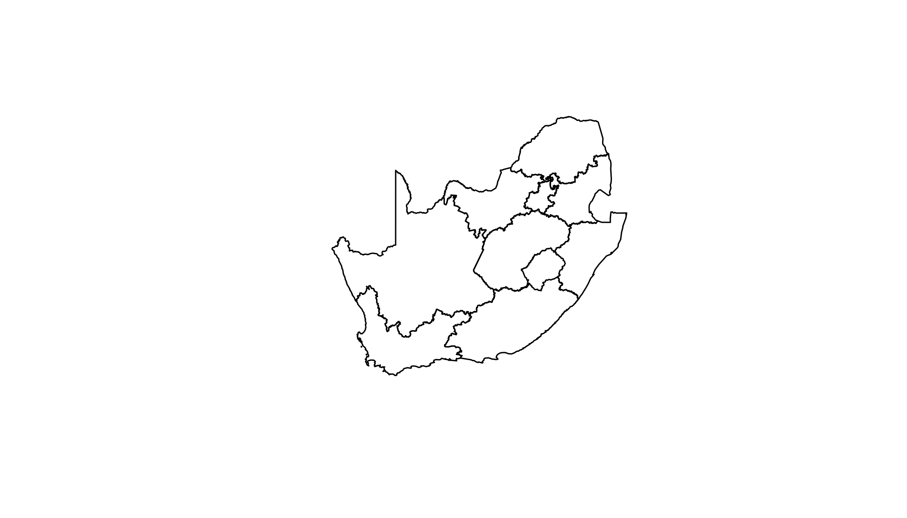<!-- -->


### Check out attribute table


```r
za@data
```

```
##   OBJECTID ID_0 ISO       NAME_0 ID_1        NAME_1 HASC_1 CCN_1 CCA_1
## 1        1  211 ZAF South Africa    1  Eastern Cape  ZA.EC    NA    EC
## 2        2  211 ZAF South Africa    2    Free State  ZA.FS    NA    FS
## 3        3  211 ZAF South Africa    3       Gauteng  ZA.GT    NA    GT
## 4        4  211 ZAF South Africa    4 KwaZulu-Natal  ZA.NL    NA   KZN
## 5        5  211 ZAF South Africa    5       Limpopo  ZA.NP    NA   LIM
## 6        6  211 ZAF South Africa    6    Mpumalanga  ZA.MP    NA    MP
## 7        7  211 ZAF South Africa    7    North West  ZA.NW    NA    NW
## 8        8  211 ZAF South Africa    8 Northern Cape  ZA.NC    NA    NC
## 9        9  211 ZAF South Africa    9  Western Cape  ZA.WC    NA    WC
##      TYPE_1 ENGTYPE_1 NL_NAME_1
## 1 Provinsie  Province          
## 2 Provinsie  Province          
## 3 Provinsie  Province          
## 4 Provinsie  Province          
## 5 Provinsie  Province          
## 6 Provinsie  Province          
## 7 Provinsie  Province          
## 8 Provinsie  Province          
## 9 Provinsie  Province          
##                                                   VARNAME_1
## 1                                                  Oos-Kaap
## 2                                Orange Free State|Vrystaat
## 3                               Pretoria/Witwatersrand/Vaal
## 4                                        Natal and Zululand
## 5 Noordelike Provinsie|Northern Transvaal|Northern Province
## 6                                         Eastern Transvaal
## 7                                       North-West|Noordwes
## 8                                                Noord-Kaap
## 9                                                  Wes-Kaap
```


Plot a subsetted region:

```r
subset(za,NAME_1=="Western Cape") %>% gSimplify(0.01) %>%
  plot()
```

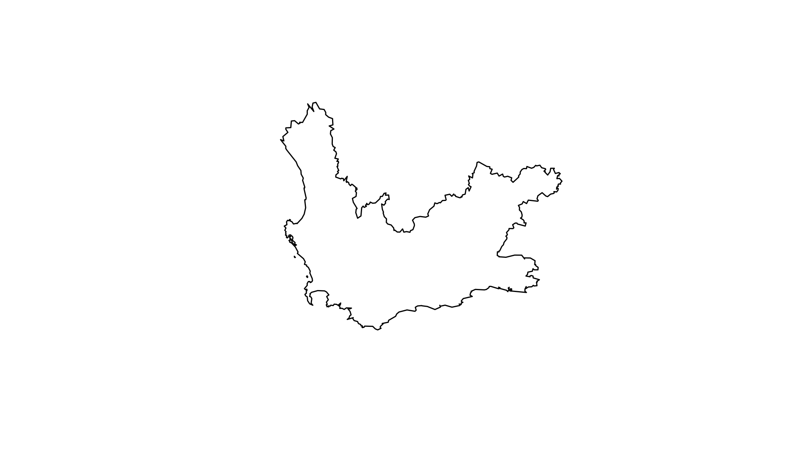<!-- -->


<div class="well">
## Your turn

Use the method above to download and plot the boundaries for a country of your choice.

<button data-toggle="collapse" class="btn btn-primary btn-sm round" data-target="#demo1">Show Solution</button>
<div id="demo1" class="collapse">


```r
getData("ISO3")%>%
  as.data.frame%>%
  filter(NAME=="Tunisia")
```

```
##   ISO3    NAME
## 1  TUN Tunisia
```

```r
country=getData('GADM', country='TUN', level=2)

country%>% 
  gSimplify(0.01)%>%
  plot()
```

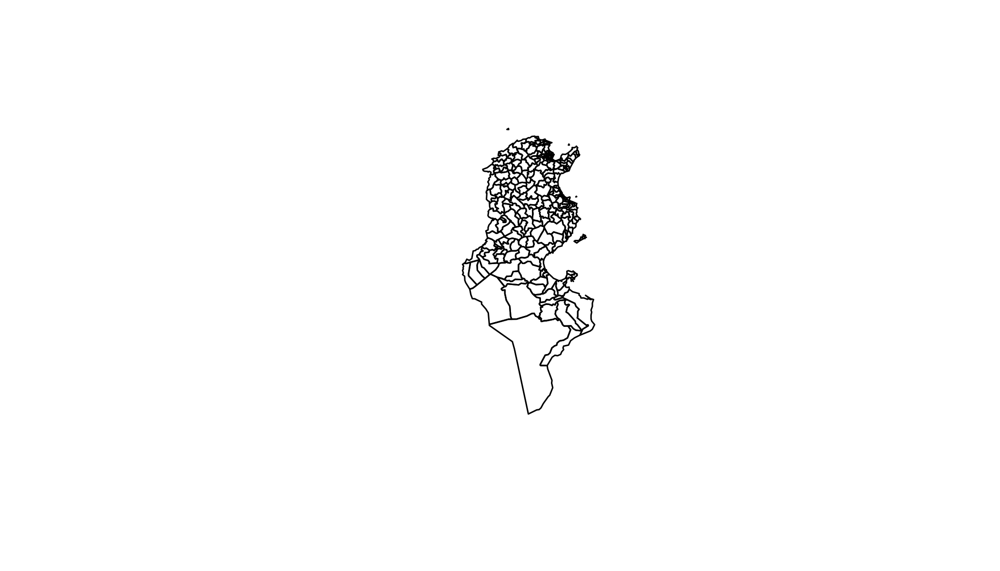<!-- -->
</div>
</div>


# Raster Data

## Raster introduction

Spatial data structure dividing region ('grid') into rectangles (’cells’ or ’pixels’) storing one or more values each.

<small> Some examples from the [Raster vignette](http://cran.r-project.org/web/packages/raster/vignettes/Raster.pdf) by Robert J. Hijmans. </small>

* `rasterLayer`: 1 band
* `rasterStack`: Multiple Bands
* `rasterBrick`: Multiple Bands of _same_ thing.


```r
x <- raster()
x
```

```
## class       : RasterLayer 
## dimensions  : 180, 360, 64800  (nrow, ncol, ncell)
## resolution  : 1, 1  (x, y)
## extent      : -180, 180, -90, 90  (xmin, xmax, ymin, ymax)
## coord. ref. : +proj=longlat +datum=WGS84 +ellps=WGS84 +towgs84=0,0,0
```


```r
str(x)
```

```
## Formal class 'RasterLayer' [package "raster"] with 12 slots
##   ..@ file    :Formal class '.RasterFile' [package "raster"] with 13 slots
##   .. .. ..@ name        : chr ""
##   .. .. ..@ datanotation: chr "FLT4S"
##   .. .. ..@ byteorder   : chr "little"
##   .. .. ..@ nodatavalue : num -Inf
##   .. .. ..@ NAchanged   : logi FALSE
##   .. .. ..@ nbands      : int 1
##   .. .. ..@ bandorder   : chr "BIL"
##   .. .. ..@ offset      : int 0
##   .. .. ..@ toptobottom : logi TRUE
##   .. .. ..@ blockrows   : int 0
##   .. .. ..@ blockcols   : int 0
##   .. .. ..@ driver      : chr ""
##   .. .. ..@ open        : logi FALSE
##   ..@ data    :Formal class '.SingleLayerData' [package "raster"] with 13 slots
##   .. .. ..@ values    : logi(0) 
##   .. .. ..@ offset    : num 0
##   .. .. ..@ gain      : num 1
##   .. .. ..@ inmemory  : logi FALSE
##   .. .. ..@ fromdisk  : logi FALSE
##   .. .. ..@ isfactor  : logi FALSE
##   .. .. ..@ attributes: list()
##   .. .. ..@ haveminmax: logi FALSE
##   .. .. ..@ min       : num Inf
##   .. .. ..@ max       : num -Inf
##   .. .. ..@ band      : int 1
##   .. .. ..@ unit      : chr ""
##   .. .. ..@ names     : chr ""
##   ..@ legend  :Formal class '.RasterLegend' [package "raster"] with 5 slots
##   .. .. ..@ type      : chr(0) 
##   .. .. ..@ values    : logi(0) 
##   .. .. ..@ color     : logi(0) 
##   .. .. ..@ names     : logi(0) 
##   .. .. ..@ colortable: logi(0) 
##   ..@ title   : chr(0) 
##   ..@ extent  :Formal class 'Extent' [package "raster"] with 4 slots
##   .. .. ..@ xmin: num -180
##   .. .. ..@ xmax: num 180
##   .. .. ..@ ymin: num -90
##   .. .. ..@ ymax: num 90
##   ..@ rotated : logi FALSE
##   ..@ rotation:Formal class '.Rotation' [package "raster"] with 2 slots
##   .. .. ..@ geotrans: num(0) 
##   .. .. ..@ transfun:function ()  
##   ..@ ncols   : int 360
##   ..@ nrows   : int 180
##   ..@ crs     :Formal class 'CRS' [package "sp"] with 1 slot
##   .. .. ..@ projargs: chr "+proj=longlat +datum=WGS84 +ellps=WGS84 +towgs84=0,0,0"
##   ..@ history : list()
##   ..@ z       : list()
```


```r
x <- raster(ncol=36, nrow=18, xmn=-1000, xmx=1000, ymn=-100, ymx=900)
res(x)
```

```
## [1] 55.55556 55.55556
```

```r
res(x) <- 100
res(x)
```

```
## [1] 100 100
```

```r
ncol(x)
```

```
## [1] 20
```


```r
# change the numer of columns (affects resolution)
ncol(x) <- 18
ncol(x)
```

```
## [1] 18
```

```r
res(x)
```

```
## [1] 111.1111 100.0000
```

## Raster data storage


```r
r <- raster(ncol=10, nrow=10)
ncell(r)
```

```
## [1] 100
```
But it is an empty raster

```r
hasValues(r)
```

```
## [1] FALSE
```


Use `values()` function:

```r
values(r) <- 1:ncell(r)
hasValues(r)
```

```
## [1] TRUE
```

```r
values(r)[1:10]
```

```
##  [1]  1  2  3  4  5  6  7  8  9 10
```


<div class="well">
## Your turn

Create and then plot a new raster with:

1. 100 rows
2. 50 columns
3. Fill it with random values (`rnorm()`)

<button data-toggle="collapse" class="btn btn-primary btn-sm round" data-target="#demo2">Show Solution</button>
<div id="demo2" class="collapse">


```r
x=raster(nrow=100,ncol=50,vals=rnorm(100*50))
# OR
x= raster(nrow=100,ncol=50)
values(x)= rnorm(5000)

plot(x)
```

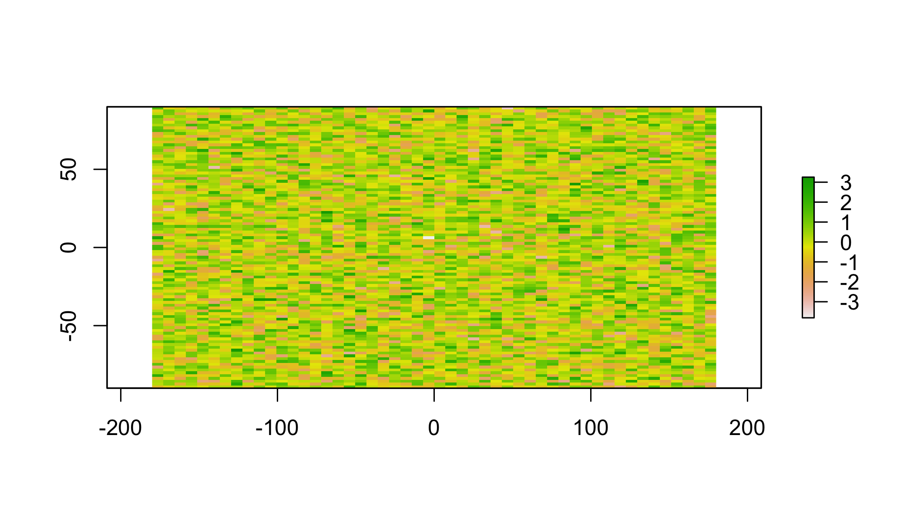<!-- -->
</div>
</div>


Raster memory usage


```r
inMemory(r)
```

```
## [1] TRUE
```
> You can change the memory options using the `maxmemory` option in `rasterOptions()` 

## Raster Plotting

Plotting is easy (but slow) with `plot`.


```r
plot(r, main='Raster with 100 cells')
```

<!-- -->


### ggplot and rasterVis

rasterVis package has `gplot()` for plotting raster data in the `ggplot()` framework.


```r
gplot(r,maxpixels=50000)+
  geom_raster(aes(fill=value))
```

<!-- -->


Adjust `maxpixels` for faster plotting of large datasets.


```r
gplot(r,maxpixels=10)+
  geom_raster(aes(fill=value))
```

<!-- -->


Can use all the `ggplot` color ramps, etc.


```r
gplot(r)+geom_raster(aes(fill=value))+
    scale_fill_distiller(palette="OrRd")
```

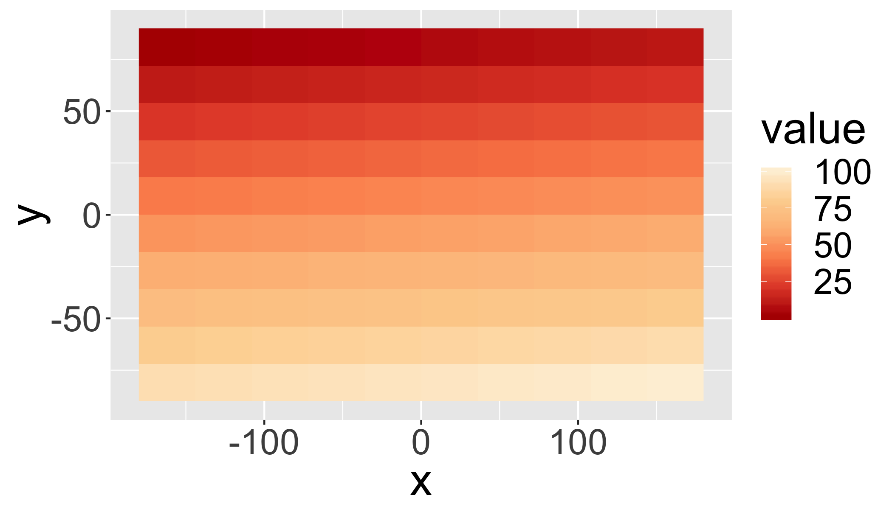<!-- -->


## Spatial Projections

Raster package uses standard [coordinate reference system (CRS)](http://www.spatialreference.org).  

For example, see the projection format for the [_standard_ WGS84](http://www.spatialreference.org/ref/epsg/4326/).

```r
projection(r)
```

```
## [1] "+proj=longlat +datum=WGS84 +ellps=WGS84 +towgs84=0,0,0"
```

## Warping rasters

Use `projectRaster()` to _warp_ to a different projection.

`method=` `ngb` (for categorical) or `bilinear` (continuous)


```r
r2=projectRaster(r,crs="+proj=sinu +lon_0=0",method = "ngb")
```

```
## Warning in rgdal::rawTransform(projto_int, projfrom, nrow(xy), xy[, 1], :
## 48 projected point(s) not finite
```

```r
par(mfrow=c(1,2));plot(r);plot(r2)
```

<!-- -->


# WorldClim

## Overview of WorldClim

Mean monthly climate and derived variables interpolated from weather stations on a 30 arc-second (~1km) grid.
See [worldclim.org](http://www.worldclim.org/methods)


## Bioclim variables

<small>

Variable      Description
-    -
BIO1          Annual Mean Temperature
BIO2          Mean Diurnal Range (Mean of monthly (max temp – min temp))
BIO3          Isothermality (BIO2/BIO7) (* 100)
BIO4          Temperature Seasonality (standard deviation *100)
BIO5          Max Temperature of Warmest Month
BIO6          Min Temperature of Coldest Month
BIO7          Temperature Annual Range (BIO5-BIO6)
BIO8          Mean Temperature of Wettest Quarter
BIO9          Mean Temperature of Driest Quarter
BIO10         Mean Temperature of Warmest Quarter
BIO11         Mean Temperature of Coldest Quarter
BIO12         Annual Precipitation
BIO13         Precipitation of Wettest Month
BIO14         Precipitation of Driest Month
BIO15         Precipitation Seasonality (Coefficient of Variation)
BIO16         Precipitation of Wettest Quarter
BIO17         Precipitation of Driest Quarter
BIO18         Precipitation of Warmest Quarter
BIO19         Precipitation of Coldest Quarter

</small>


## Download climate data

Download the data:


```r
clim=raster::getData('worldclim', var='bio', res=10)  
```

`res` is resolution (0.5, 2.5, 5, and 10 minutes of a degree)

Instead of downloading the full dataset, we'll use the copy in the `DataScienceData` package:


```r
data(worldclim)

#rename for convenience
clim=worldclim
```


### Gain and Offset


```r
clim
```

```
## class       : RasterStack 
## dimensions  : 900, 2160, 1944000, 19  (nrow, ncol, ncell, nlayers)
## resolution  : 0.1666667, 0.1666667  (x, y)
## extent      : -180, 180, -60, 90  (xmin, xmax, ymin, ymax)
## coord. ref. : +proj=longlat +datum=WGS84 +ellps=WGS84 +towgs84=0,0,0 
## names       :  bio1,  bio2,  bio3,  bio4,  bio5,  bio6,  bio7,  bio8,  bio9, bio10, bio11, bio12, bio13, bio14, bio15, ... 
## min values  :  -269,     9,     8,    72,   -59,  -547,    53,  -251,  -450,   -97,  -488,     0,     0,     0,     0, ... 
## max values  :   314,   211,    95, 22673,   489,   258,   725,   375,   364,   380,   289,  9916,  2088,   652,   261, ...
```

Note the min/max of the raster.  What are the units?  Always check metadata, the [WorldClim temperature dataset](http://www.worldclim.org/formats) has a `gain` of 0.1, meaning that it must be multipled by 0.1 to convert back to degrees Celsius. We'll set the temperature variables (see table above) to 0.1 and leave the others at 1.


```r
gain(clim)=c(rep(0.1,11),rep(1,7))
```


### Plot with `plot()`


```r
plot(clim)
```

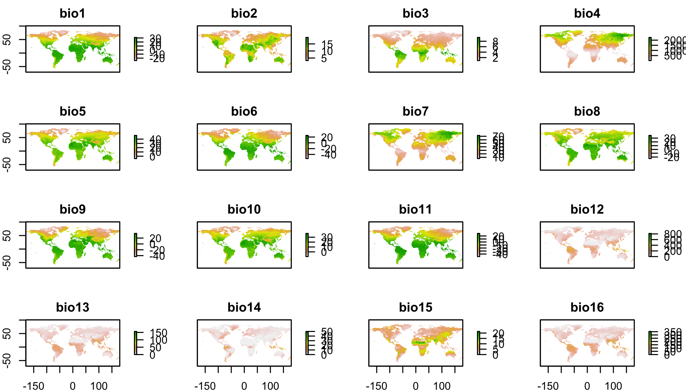<!-- -->

 

## Faceting in ggplot

Or use `rasterVis` methods with gplot

```r
gplot(clim[[13:19]])+geom_raster(aes(fill=value))+
  facet_wrap(~variable)+
  scale_fill_gradientn(colours=c("brown","red","yellow","darkgreen","green"),trans="log10")+
  coord_equal()
```

```
## Warning: Transformation introduced infinite values in discrete y-axis
```

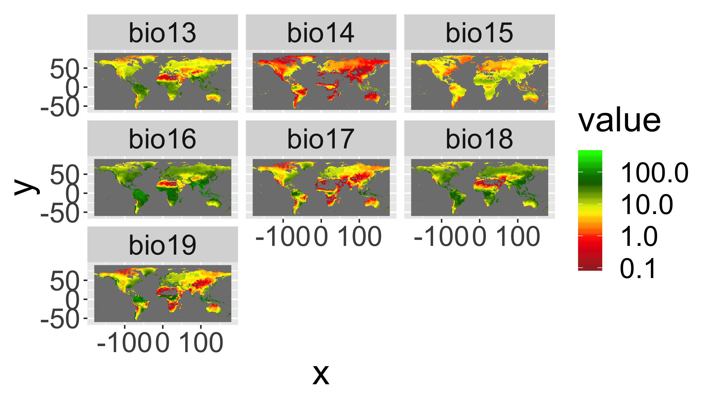<!-- -->


Let's dig a little deeper into the data object:


```r
## is it held in RAM?
inMemory(clim)
```

```
## [1] TRUE
```

```r
## How big is it?
object.size(clim)
```

```
## 295722384 bytes
```

```r
## can we work with it directly in RAM?
canProcessInMemory(clim)
```

```
## [1] TRUE
```


## Subsetting and spatial cropping

Use `[[1:3]]` to select raster layers from raster stack.


```r
## crop to a latitude/longitude box
r1 <- raster::crop(clim[[1]], extent(10,35,-35,-20))
## Crop using a Spatial polygon
r1 <- raster::crop(clim[[1]], bbox(za))
```


```r
r1
```

```
## class       : RasterLayer 
## dimensions  : 76, 98, 7448  (nrow, ncol, ncell)
## resolution  : 0.1666667, 0.1666667  (x, y)
## extent      : 16.5, 32.83333, -34.83333, -22.16667  (xmin, xmax, ymin, ymax)
## coord. ref. : +proj=longlat +datum=WGS84 +ellps=WGS84 +towgs84=0,0,0 
## data source : in memory
## names       : bio1 
## values      : 5.8, 24.6  (min, max)
```

```r
plot(r1)
```

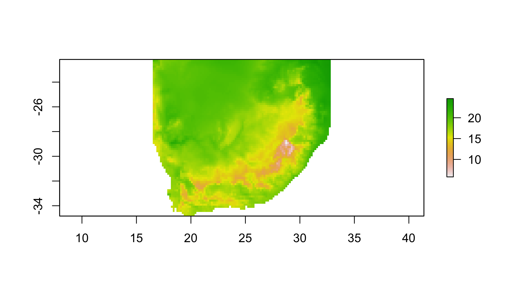<!-- -->

## Spatial aggregation

```r
## aggregate using a function
aggregate(r1, 3, fun=mean) %>%
  plot()
```

<!-- -->

<div class="well">
## Your turn
Create a new raster by aggregating to the minimum (`min`) value of `r1` within a 10 pixel window

<button data-toggle="collapse" class="btn btn-primary btn-sm round" data-target="#demo3">Show Solution</button>
<div id="demo3" class="collapse">


```r
aggregate(r1, 10, fun=min) %>%
  plot()
```

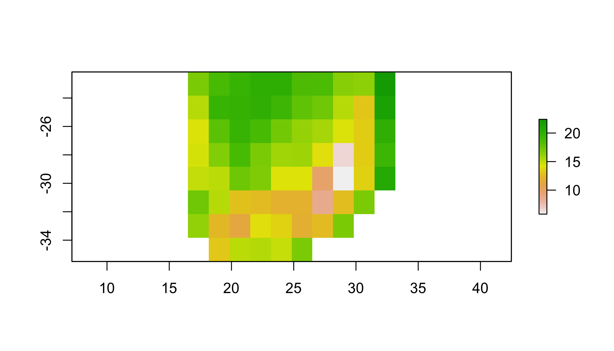<!-- -->
</div>
</div>


## Focal ("moving window")

```r
## apply a function over a moving window
focal(r1, w=matrix(1,3,3), fun=mean) %>% 
  plot()
```

<!-- -->


```r
## apply a function over a moving window
rf_min <- focal(r1, w=matrix(1,11,11), fun=min)
rf_max <- focal(r1, w=matrix(1,11,11), fun=max)
rf_range=rf_max-rf_min

## or do it all at once
range2=function(x,na.rm=F) {
  max(x,na.rm)-min(x,na.rm)
}

rf_range2 <- focal(r1, w=matrix(1,11,11), fun=range2)

plot(rf_range)
```

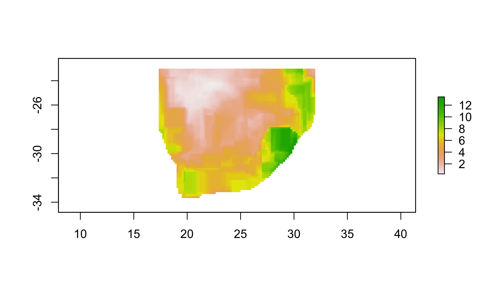<!-- -->

```r
plot(rf_range2)
```

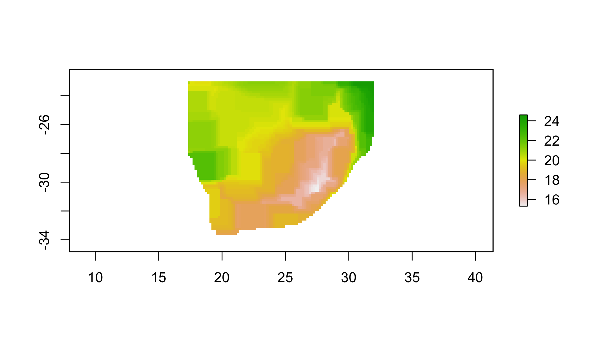<!-- -->


<div class="well">
## Your turn

Plot the focal standard deviation of `r1` over a 3x3 window.

<button data-toggle="collapse" class="btn btn-primary btn-sm round" data-target="#demo4">Show Solution</button>
<div id="demo4" class="collapse">


```r
focal(r1,w=matrix(1,3,3),fun=sd)%>%
  plot()
```

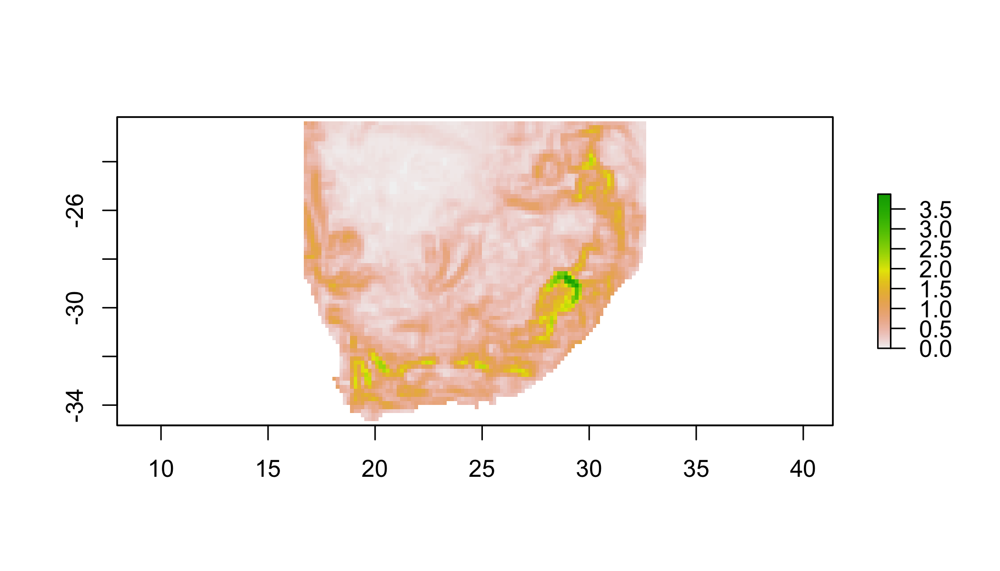<!-- -->
</div>
</div>


## Raster calculations

the `raster` package has many options for _raster algebra_, including `+`, `-`, `*`, `/`, logical operators such as `>`, `>=`, `<`, `==`, `!` and functions such as `abs`, `round`, `ceiling`, `floor`, `trunc`, `sqrt`, `log`, `log10`, `exp`, `cos`, `sin`, `max`, `min`, `range`, `prod`, `sum`, `any`, `all`.

So, for example, you can 

```r
cellStats(r1,range)
```

```
## [1]  5.8 24.6
```

```r
## add 10
s = r1 + 10
cellStats(s,range)
```

```
## [1] 15.8 34.6
```


```r
## take the square root
s = sqrt(r1)
cellStats(s,range)
```

```
## [1] 2.408319 4.959839
```

```r
# round values
r = round(r1)
cellStats(r,range)
```

```
## [1]  6 25
```

```r
# find cells with values less than 15 degrees C
r = r1 < 15
plot(r)
```

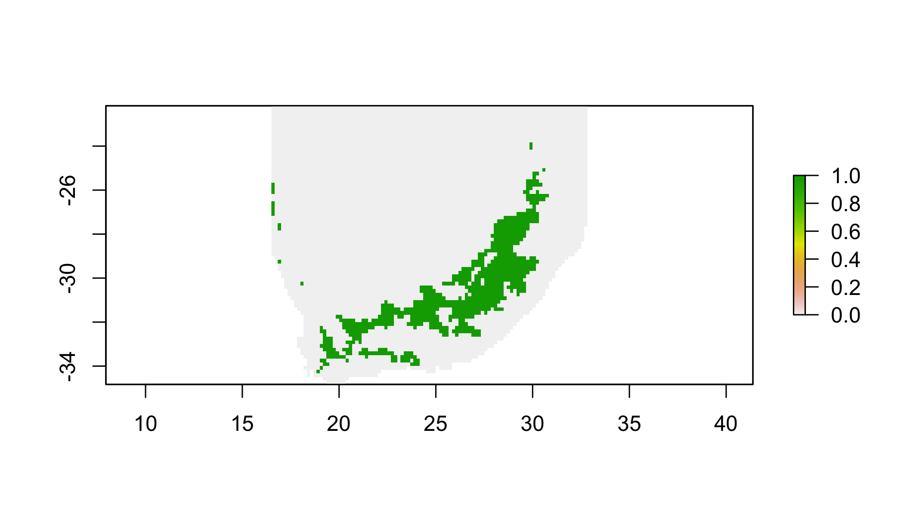<!-- -->


### Apply algebraic functions

```r
# multiply s times r and add 5
s = s * r1 + 5
cellStats(s,range)
```

```
## [1]  18.96825 127.01203
```

## Extracting Raster Data

* points
* lines
* polygons
* extent (rectangle)
* cell numbers

Extract all intersecting values OR apply a summarizing function with `fun`.


### Point data

`sampleRandom()` generates random points and automatically extracts the raster values for those points.  Also check out `?sampleStratified` and `sampleRegular()`.  

Generate 100 random points and the associated climate variables at those points.

```r
## define a new dataset of points to play with
pts=sampleRandom(clim,100,xy=T,sp=T)
plot(pts);axis(1);axis(2)
```

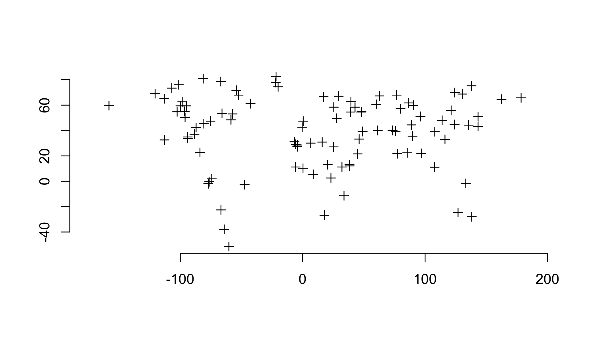<!-- -->

### Extract data using a `SpatialPoints` object
Often you will have some locations (points) for which you want data from a raster* object.  You can use the `extract` function here with the `pts` object (we'll pretend it's a new point dataset for which you want climate variables).

```r
pts_data=raster::extract(clim[[1:4]],pts,df=T)
head(pts_data)
```

```
##   ID  bio1 bio2 bio3   bio4
## 1  1  20.8 15.6  5.5  448.1
## 2  2  26.4 10.0  8.6   30.0
## 3  3   7.8  9.5  3.8  537.8
## 4  4  17.6 17.3  4.4  698.6
## 5  5 -10.6  8.4  1.6 1493.1
## 6  6   9.2  9.3  2.6  935.6
```
> Use `package::function` to avoid confusion with similar functions.


### Plot the global dataset with the random points

```r
gplot(clim[[1]])+
  geom_raster(aes(fill=value))+
  geom_point(
    data=as.data.frame(pts),
    aes(x=x,y=y),col="red")+
  coord_equal()
```

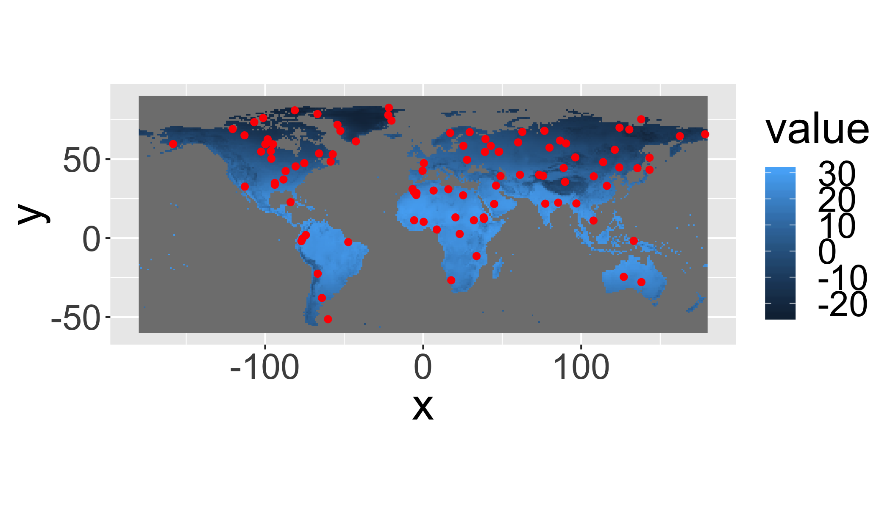<!-- -->

### Summarize climate data at point locations
Use `gather()` to reshape the climate data for easy plotting with ggplot.


```r
d2=pts_data%>%
  gather(ID)
colnames(d2)[1]="cell"
head(d2)
```

```
##   cell value
## 1 bio1  20.8
## 2 bio1  26.4
## 3 bio1   7.8
## 4 bio1  17.6
## 5 bio1 -10.6
## 6 bio1   9.2
```

And plot density plots (like histograms).

```r
ggplot(d2,aes(x=value))+
  geom_density()+
  facet_wrap(~cell,scales="free")
```

<!-- -->


### Lines

Extract values along a transect.  

```r
transect = SpatialLinesDataFrame(
  SpatialLines(list(Lines(list(Line(
    rbind(c(19, -33.5),c(26, -33.5)))), ID = "ZAF"))),
  data.frame(Z = c("transect"), row.names = c("ZAF")))

# OR

transect=SpatialLinesDataFrame(
  readWKT("LINESTRING(19 -33.5,26 -33.5)"),
  data.frame(Z = c("transect")))


gplot(r1)+geom_tile(aes(fill=value))+
  geom_line(aes(x=long,y=lat),data=fortify(transect),col="red")
```

<!-- -->


### Plot Transect


```r
trans=raster::extract(x=clim[[12:14]],
                      y=transect,
                      along=T,
                      cellnumbers=T)%>%
  data.frame()
head(trans)
```

```
##      cell bio12 bio13 bio14
## 1 1601755  81.4  13.0   2.0
## 2 1601756  71.9  11.6   1.7
## 3 1601757  56.8   8.8   1.5
## 4 1601758  47.9   7.2   1.3
## 5 1601759  41.5   6.1   1.3
## 6 1601760  36.1   5.0   1.2
```

#### Add other metadata and reshape

```r
trans[,c("lon","lat")]=coordinates(clim)[trans$cell,]
trans$order=as.integer(rownames(trans))
head(trans)  
```

```
##      cell bio12 bio13 bio14      lon       lat order
## 1 1601755  81.4  13.0   2.0 19.08333 -33.58333     1
## 2 1601756  71.9  11.6   1.7 19.25000 -33.58333     2
## 3 1601757  56.8   8.8   1.5 19.41667 -33.58333     3
## 4 1601758  47.9   7.2   1.3 19.58333 -33.58333     4
## 5 1601759  41.5   6.1   1.3 19.75000 -33.58333     5
## 6 1601760  36.1   5.0   1.2 19.91667 -33.58333     6
```


```r
transl=group_by(trans,lon,lat)%>%
  gather(variable, value, -lon, -lat, -cell, -order)
head(transl)
```

```
## # A tibble: 6 x 6
## # Groups:   lon, lat [6]
##      cell   lon   lat order variable value
##     <dbl> <dbl> <dbl> <int> <chr>    <dbl>
## 1 1601755  19.1  19.1     1 bio12     81.4
## 2 1601756  19.2  19.2     2 bio12     71.9
## 3 1601757  19.4  19.4     3 bio12     56.8
## 4 1601758  19.6  19.6     4 bio12     47.9
## 5 1601759  19.8  19.8     5 bio12     41.5
## 6 1601760  19.9  19.9     6 bio12     36.1
```


```r
ggplot(transl,aes(x=lon,y=value,
                  colour=variable,
                  group=variable,
                  order=order))+
  geom_line()
```

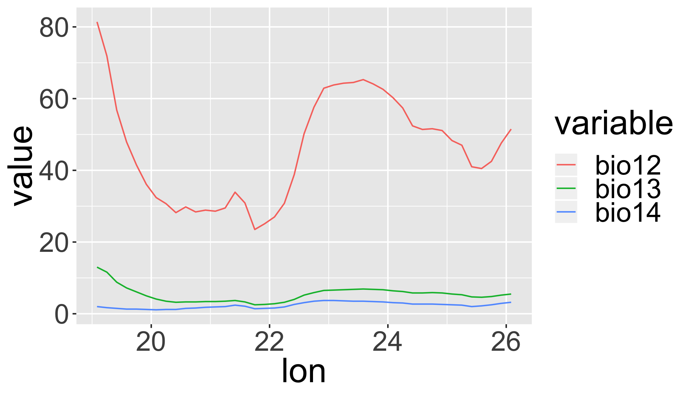<!-- -->


### _Zonal_ statistics
Calculate mean annual temperature averaged by province (polygons).


```r
rsp=raster::extract(x=r1,
                    y=gSimplify(za,0.01),
                    fun=mean,
                    sp=T)
#spplot(rsp,zcol="bio1")
```


```r
## add the ID to the dataframe itself for easier indexing in the map
rsp$id=as.numeric(rownames(rsp@data))
## create fortified version for plotting with ggplot()
frsp=fortify(rsp,region="id")

ggplot(rsp@data, aes(map_id = id, fill=bio1)) +
    expand_limits(x = frsp$long, y = frsp$lat)+
    scale_fill_gradientn(
      colours = c("grey","goldenrod","darkgreen","green"))+
    coord_map()+
    geom_map(map = frsp)
```

<!-- -->

> For more details about plotting spatialPolygons, see [here](https://github.com/hadley/ggplot2/wiki/plotting-polygon-shapefiles)

## Example Workflow


1. Download the Maximum Temperature dataset using `getData()`
2. Set the gain to 0.1 (to convert to degrees Celcius)
2. Crop it to the country you downloaded (or ZA?)
2. Calculate the overall range for each variable with `cellStats()`
3. Calculate the focal median with an 11x11 window with `focal()`
4. Create a transect across the region and extract the temperature data.


```r
country=getData('GADM', country='TUN', level=1)%>%gSimplify(0.01)
tmax=getData('worldclim', var='tmax', res=10)
gain(tmax)=0.1
names(tmax)
```

```
##  [1] "tmax1"  "tmax2"  "tmax3"  "tmax4"  "tmax5"  "tmax6"  "tmax7" 
##  [8] "tmax8"  "tmax9"  "tmax10" "tmax11" "tmax12"
```

Default layer names can be problematic/undesirable.

```r
sort(names(tmax))
```

```
##  [1] "tmax1"  "tmax10" "tmax11" "tmax12" "tmax2"  "tmax3"  "tmax4" 
##  [8] "tmax5"  "tmax6"  "tmax7"  "tmax8"  "tmax9"
```

```r
## Options
month.name
```

```
##  [1] "January"   "February"  "March"     "April"     "May"      
##  [6] "June"      "July"      "August"    "September" "October"  
## [11] "November"  "December"
```

```r
month.abb
```

```
##  [1] "Jan" "Feb" "Mar" "Apr" "May" "Jun" "Jul" "Aug" "Sep" "Oct" "Nov"
## [12] "Dec"
```

```r
sprintf("%02d",1:12)
```

```
##  [1] "01" "02" "03" "04" "05" "06" "07" "08" "09" "10" "11" "12"
```

```r
sprintf("%04d",1:12)
```

```
##  [1] "0001" "0002" "0003" "0004" "0005" "0006" "0007" "0008" "0009" "0010"
## [11] "0011" "0012"
```
See `?sprintf` for details


```r
names(tmax)=sprintf("%02d",1:12)

tmax_crop=crop(tmax,country)
tmaxave_crop=mean(tmax_crop)  # calculate mean annual maximum temperature 
tmaxavefocal_crop=focal(tmaxave_crop,
                        fun=median,
                        w=matrix(1,11,11))
```

> Only a few datasets are available usig `getData()` in the raster package, but you can download almost any file on the web with `file.download()`.

Report quantiles for each layer in a raster* object

```r
cellStats(tmax_crop,"quantile")
```

```
##       X01  X02  X03  X04  X05  X06  X07  X08  X09  X10  X11  X12
## 0%    8.4 10.1 13.8 17.4 21.9 26.4 29.6 30.3 26.6 19.7 14.1  9.6
## 25%  14.1 15.8 18.3 21.3 25.7 30.4 34.6 34.0 30.3 25.3 20.2 15.4
## 50%  15.3 17.4 21.0 25.0 28.9 33.3 36.4 35.8 32.8 27.6 21.7 16.6
## 75%  16.3 19.0 23.0 27.4 31.9 36.4 39.7 39.0 35.3 29.0 22.4 17.4
## 100% 18.1 21.2 25.6 31.2 35.9 41.4 43.3 42.6 38.5 31.9 24.5 18.9
```


## Create a Transect  (SpatialLinesDataFrame)

```r
transect=SpatialLinesDataFrame(
  readWKT("LINESTRING(8 36,10 36)"),
  data.frame(Z = c("T1")))
```


## Plot the timeseries of climate data

```r
gplot(tmax_crop)+
  geom_tile(aes(fill=value))+
  scale_fill_gradientn(
    colours=c("brown","red","yellow","darkgreen","green"),
    name="Temp")+
  facet_wrap(~variable)+
  ## now add country overlays
  geom_path(data=fortify(country),
            mapping=aes(x=long,y=lat,
                        group=group,
                        order=order))+
  # now add transect line
  geom_line(aes(x=long,y=lat),
            data=fortify(transect),col="red",size=3)+
  coord_map()
```

```
## Warning: Ignoring unknown aesthetics: order
```

<!-- -->


## Extract and clean up the transect data

```r
trans=raster::extract(tmax_crop,
                      transect,
                      along=T,
                      cellnumbers=T)%>% 
  as.data.frame()
trans[,c("lon","lat")]=coordinates(tmax_crop)[trans$cell]
trans$order=as.integer(rownames(trans))
head(trans)
```

```
##   cell  X01  X02  X03  X04  X05  X06  X07  X08  X09  X10  X11  X12
## 1  229 12.0 13.3 16.7 20.4 24.5 30.4 34.5 33.9 29.4 23.0 17.3 13.0
## 2  230 12.6 14.1 17.4 21.1 25.3 31.4 35.5 34.9 30.3 23.8 18.0 13.8
## 3  231 12.8 14.3 17.6 21.3 25.6 31.8 36.1 35.4 30.7 24.1 18.2 14.0
## 4  232 11.8 13.3 16.8 20.6 25.0 31.1 35.7 34.8 30.0 23.4 17.4 13.1
## 5  233 11.6 13.1 16.6 20.4 25.0 30.9 35.7 34.7 29.9 23.3 17.4 13.0
## 6  234 11.3 12.7 16.3 20.0 24.8 30.5 35.4 34.4 29.6 23.2 17.3 12.8
##        lon      lat order
## 1 8.083333 8.083333     1
## 2 8.250000 8.250000     2
## 3 8.416667 8.416667     3
## 4 8.583333 8.583333     4
## 5 8.750000 8.750000     5
## 6 8.916667 8.916667     6
```

Reformat to 'long' format.

```r
transl=group_by(trans,lon,lat)%>%
  gather(variable, value, -lon, -lat, -cell, -order)%>%
  separate(variable,into = c("X","month"),1)%>%
  mutate(month=as.numeric(month),monthname=factor(month.name[month],ordered=T,levels=month.name))
head(transl)
```

```
## # A tibble: 6 x 8
## # Groups:   lon, lat [6]
##    cell   lon   lat order X     month value monthname
##   <dbl> <dbl> <dbl> <int> <chr> <dbl> <dbl> <ord>    
## 1   229  8.08  8.08     1 X         1  12   January  
## 2   230  8.25  8.25     2 X         1  12.6 January  
## 3   231  8.42  8.42     3 X         1  12.8 January  
## 4   232  8.58  8.58     4 X         1  11.8 January  
## 5   233  8.75  8.75     5 X         1  11.6 January  
## 6   234  8.92  8.92     6 X         1  11.3 January
```

## Plot the transect data

```r
ggplot(transl,
       aes(x=lon,y=value,
           colour=month,
           group=month,
           order=order))+
  ylab("Maximum Temp")+
    scale_color_gradientn(
      colors=c("blue","green","red"),
      name="Month")+
    geom_line()
```

<!-- -->

Or the same data in a levelplot:

```r
ggplot(transl,
       aes(x=lon,y=monthname,
           fill=value))+
  ylab("Month")+
    scale_fill_distiller(
      palette="PuBuGn",
      name="Tmax")+
    geom_raster()
```

<!-- -->


## Raster Processing

Things to consider:

* RAM limitations
* Disk space and temporary files
* Use of external programs (e.g. GDAL)
* Use of external GIS viewer (e.g. QGIS)
