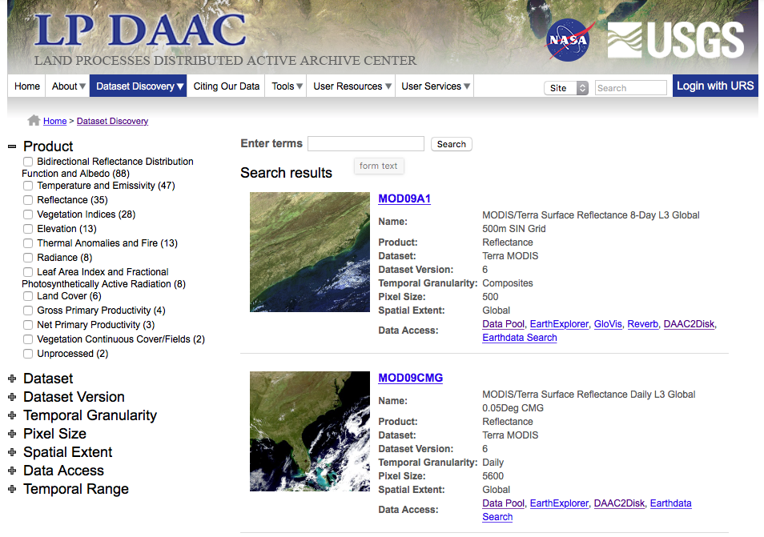
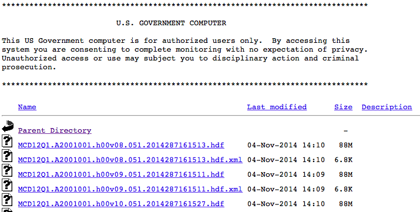
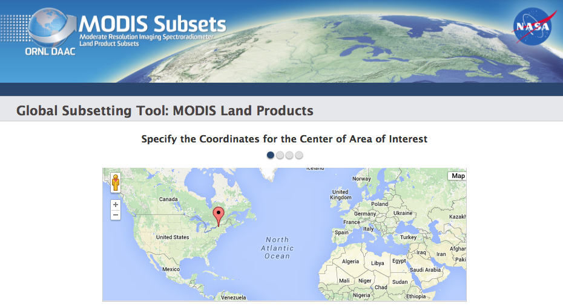
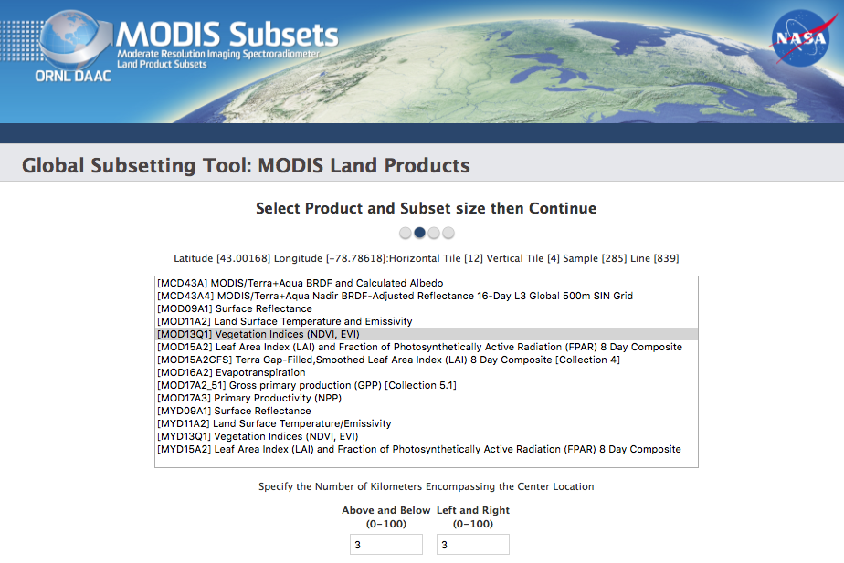
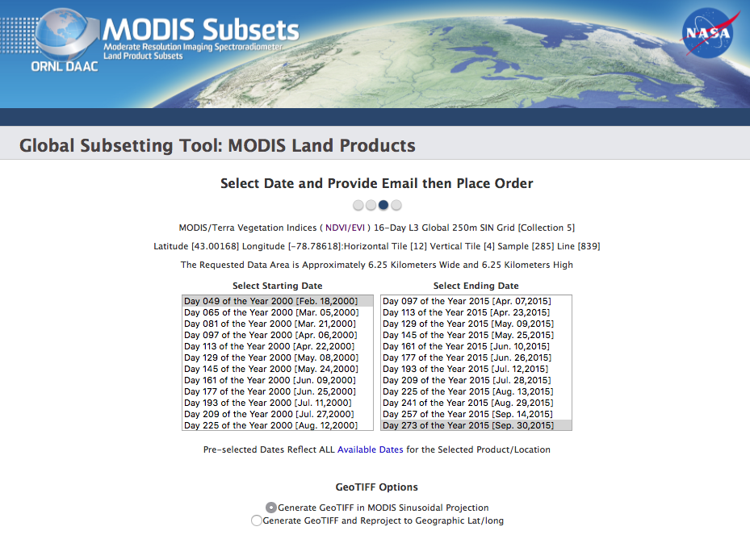

Processing Data from Satellite Remote Sensing
=============

Objectives
==========
* Brief introduction to remote sensing
* Obtaining NASA remote sensing data
* MODIS
* MODIStools package

Active Earth Observing Satellites (EOS) (as of 8/31/2015)
=============

* Total number of operating satellites: 1,305
* Total Earth Observing Satellites (EOS): 333 
    * United States: 34%
    * China: 21%	
    * Japan 6.3%

From the [Union of Concerned Scientists Satellite Database](http://www.ucsusa.org/nuclear-weapons/space-weapons/satellite-database.html#.VjzlnoS98VQ) and [Pixalytics Blog](http://www.pixalytics.com/blog/)

Debris & Satellites in low Earth orbit
=============

Image courtesy of [European Space Agency](http://www.esa.int/spaceinimages/Images/2008/03/Debris_objects_-_mostly_debris_-_in_low_Earth_orbit_LEO_-_view_over_the_equator)

NASA's Earth Observing System
=============

Passive Remote Sensing
=============

Electromagnetic Radiation
=============

EarthData
=============

[EarthData.nasa.gov](https://earthdata.nasa.gov)

Datasets, news, articles, information

EarthData
=============

[EarthData.nasa.gov](https://earthdata.nasa.gov)

Datasets, news, articles, information

Moderate Resolution Imaging Spectroradiometer (MODIS)
=============

2 Satellites _Terra_ launched in 1999, _Aqua_ in 2002.

Technical Details: swath
=============

Viewing swath width of 2,330 km

Technical Details: spatial coverage
=============

Covers Earth every one to two days

Technical Details: spectral coverage
=============

36 spectral bands between 0.405 and 14.385 µm

Technical Details: spatial resolution
=============

3 spatial resolutions -- 250m, 500m, and 1,000m 

MODIS Data Processing
=============

* Tracking and Data Relay Satellite System in White Sands, New Mexico
* EOS Data and Operations System @ Goddard Space Flight Center in Greenbelt, MD
* MODIS Adaptive Processing System (MODAPS)
* 3 DAACs for distribution

MODIS products (a subset...)
=============

Atmosphere
=============
* Aerosol & Clouds
* Total Precipitable Water

Cryosphere Products
=============
* Snow Cover
* Sea Ice and Ice Surface Temperature

Ocean Products
=============

* Sea Surface Temperature
* Sub-surface Chlorophyll-a Concentration
* Particulate Carbon
* Photosynthetically Available Radiation

Land Products
=============

* Surface Reflectance
* Land Surface Temperature and Emissivity
* Land Cover Products
* Vegetation Index Products (NDVI and EVI)
* Thermal Anomalies - Active Fires
* Photosynthetically Active Radiation (FPAR) / Leaf Area Index (LAI)
* Evapotranspiration
* Primary Productivity
* Vegetation Continuous Fields
* Water Mask
* Burned Area Product

Example product workflow
=============

 

 
MODIS Products used to generate vegetation indices. From the [MOD13 Algorithm Theoretical Basis Document](http://modis.gsfc.nasa.gov/data/atbd/atbd_mod13.pdf).  

Data formats
=============

Most NASA EOS data distributed as HDF files, which are very similar to netCDF.

NetCDF / HDF
=============

Collection-Level Naming Conventsions 
=============

`MODIS/Terra Surface Reflectance 8-Day L3 Global 500m SIN Grid V005`

* `MODIS/Terra` - Instrument/Sensor
* `Surface Reflectance` - Geophysical Parameter
* `8-Day` - Temporal Resolution
* `L3` - Processing Level
* `Global` - Global or Swath
* `500m` - Spatial Resolution
* `SIN Grid` - Gridded or Not
* `V005` - Collection Version

MODIS Gridding system
=============

Filename Conventions
=============

`MOD09A1.A2006001.h08v05.005.2006012234657.hdf`

* `MOD09A1` - Product Short Name
* `.A2006001` - Julian Date of Acquisition (A-YYYYDDD)
* `.h08v05` - Tile Identifier (horizontalXXverticalYY)
* `.005` - Collection Version
* `.2006012234567` - Julian Date of Production (YYYYDDDHHMMSS)
* `.hdf` - Data Format (HDF-EOS)

MODIS Temporal Resolution
=============

* Daily
* 8-Day
* 16-Day
* Monthly
* Quarterly
* Yearly

MODIS Spatial Resolution
=============

* **Bands 1–2**  250-meter
* **Bands 3–7**  500-meter
* **Bands 8–36**  1000-meter

MODIS Data
=============

### Distributed Active Archive Centers (DAACs)

* **Level 1 data:** geolocation, cloud mask, and atmosphere products [ladsweb.nascom.nasa.gov](http://ladsweb.nascom.nasa.gov/)
* **Land products:** [lpdaac.usgs.gov](https://lpdaac.usgs.gov/)
* **Cryosphere (snow/ice) products:** [nsidc.org/daac/modis](http://nsidc.org/daac/modis/index.html)
* **Ocean color and sea surface temperature:** [oceancolor.gsfc.nasa.gov](http://oceancolor.gsfc.nasa.gov/)

Accessing data
=============

The Land Processes Distributed Active Archive Center has a nice "Data Discovery" Tool:

MODIS Products Table
=============
Lists [all available MODIS land products]()

Annual Land Cover Type Description
=============

Detailed layer information
=============

Data access links
=============

Downloading: `http`/`ftp` access
=============

or the [LP DAAC2Disk Download Manager](https://lpdaac.usgs.gov/sites/default/files/public/datapool/DAAC2DiskUserGuide.pdf) which builds a download script.

MODIS Reprojection Tool
=============
Available at [lpdaac.usgs.gov/tools/modis_reprojection_tool](https://lpdaac.usgs.gov/tools/modis_reprojection_tool).

MODIS Reprojection Tool:  Subset & Reproject
=============

`MCD12Q1.A2012001.h12v04.051.2014288200441.hdf`

MODIS Web Services
=============

[daacmodis.ornl.gov/cgi-bin/MODIS/GLBVIZ_1_Glb/modis_subset_order_global_col5.pl](http://daacmodis.ornl.gov/cgi-bin/MODIS/GLBVIZ_1_Glb/modis_subset_order_global_col5.pl)

* Provide access to regional subsets (<100x100km)
* Merge across tiles
* Download full time series

MODIS Subset: Spatial
=============

MODIS Subset: Variables
=============

MODIS Subset: Temporal
=============

Submit email and wait for results...

MODIS Subset: Results & Download
=============

MODIS Subsets: API
=============

Subsets of MODIS Land Products through **Simple Object Access Protocol** (`SOAP`). 

`MODISTools` R package.

Presentation Credits
=============

* Images: NASA
* Some contents from Steve Ackerman `stevea@ssec.wisc.edu`, Cooperative Institute for Meteorological Satellite Studies, University of Wisconsin-Madison
