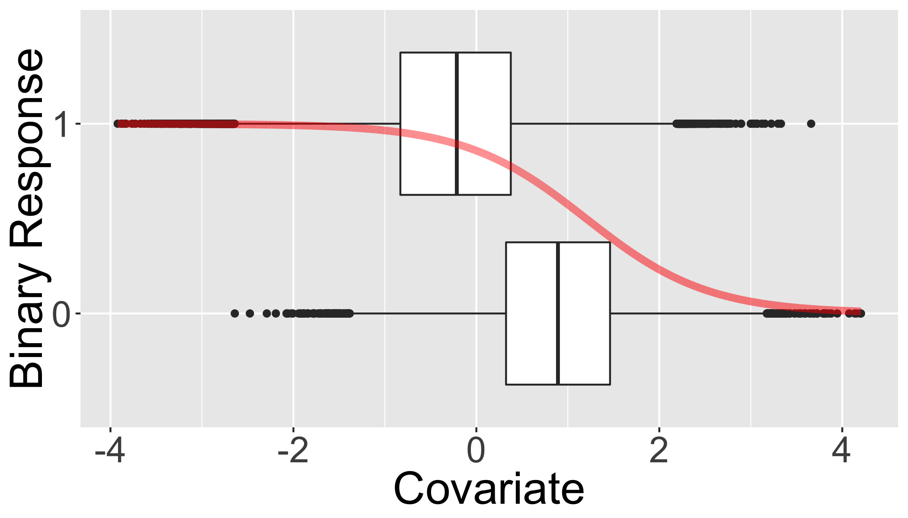
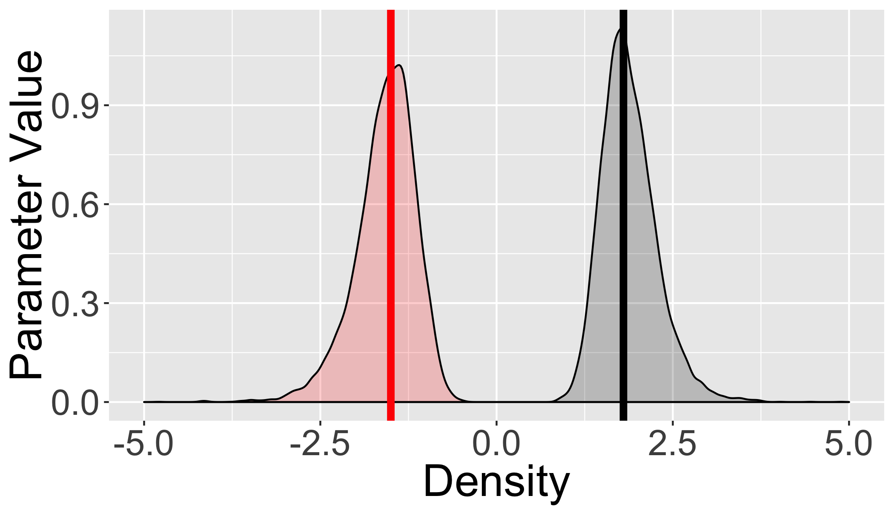
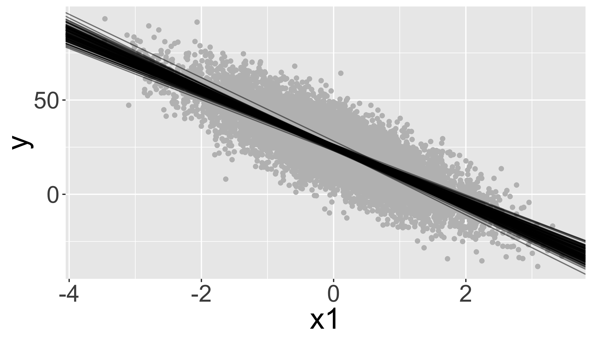
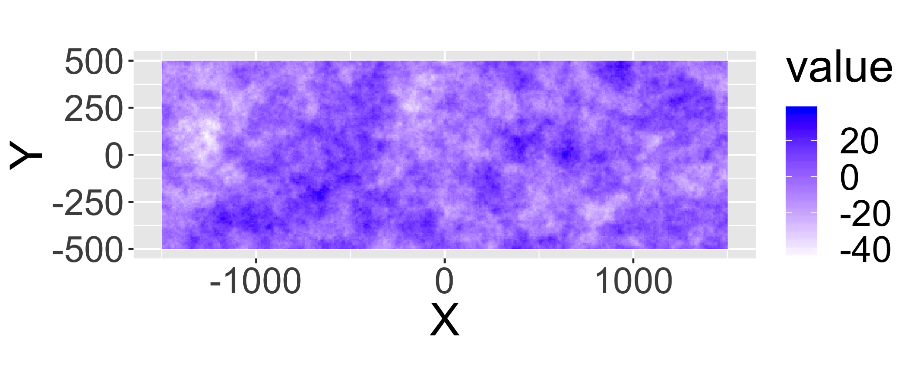
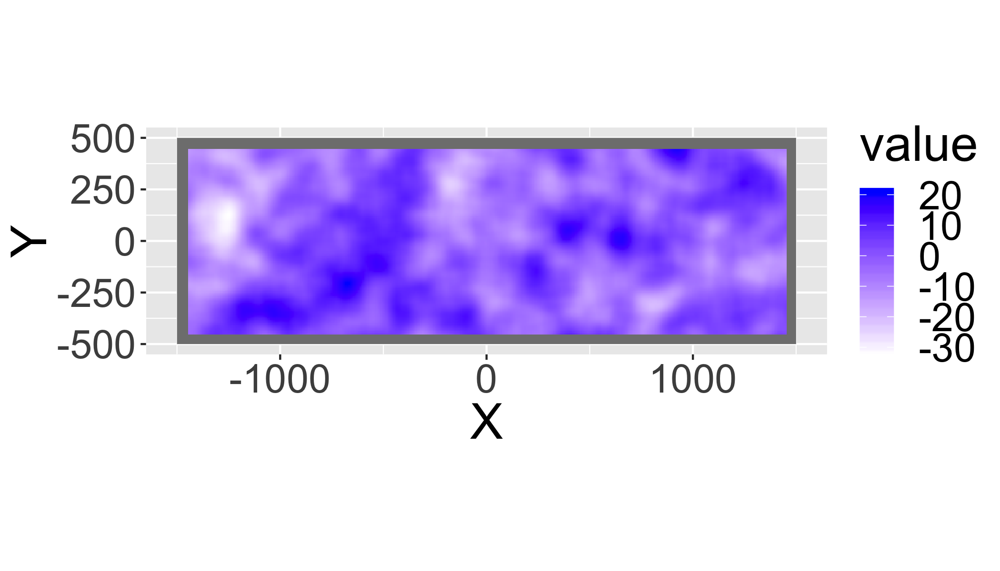

<div class="h_iframe">
<iframe src="11_Presentation/ParallelProcessingIntro.html"> </iframe>
</div>


[<i class="fa fa-file-code-o fa-3x" aria-hidden="true"></i> The R Script associated with this page is available here](scripts/11_ParallelProcessing.R).  Download this file and open it (or copy-paste into a new script) with RStudio so you can follow along.  


 

```r
library(knitr)
library(raster)
library(rasterVis)
library(dplyr)
library(ggplot2)

## New Packages
library(foreach)
library(doParallel)
library(arm)
library(fields)
library(snow)
```

If you don't have the packages above, install them in the package manager or by running `install.packages("doParallel")`. 

# Simple examples

## _Sequential_ `for()` loop

```r
x=vector()
for(i in 1:3) 
  x[i]=i^2

x
```

```
## [1] 1 4 9
```


## _Sequential_ `foreach()` loop

```r
x <- foreach(i=1:3) %do% 
  i^2

x
```

```
## [[1]]
## [1] 1
## 
## [[2]]
## [1] 4
## 
## [[3]]
## [1] 9
```

Note that `x` is a list with one element for each iterator variable (`i`).  You can also specify a function to use to combine the outputs with `.combine`.  Let's concatenate the results into a vector with `c`.

## _Sequential_ `foreach()` loop with `.combine`

```r
x <- foreach(i=1:3,.combine='c') %do% 
  i^2

x
```

```
## [1] 1 4 9
```

Tells `foreach()` to first calculate each iteration, then `.combine` them with a `c(...)`

## _Sequential_ `foreach()` loop with `.combine`

```r
x <- foreach(i=1:3,.combine='rbind') %do% 
  i^2
x
```

```
##          [,1]
## result.1    1
## result.2    4
## result.3    9
```


<div class="well">
## Your turn
Write a `foreach()` loop that:

* generates 10 sets of 100 random values from a normal distribution (`rnorm()`)
* column-binds (`cbind`) them.  

<button data-toggle="collapse" class="btn btn-primary btn-sm round" data-target="#demo1">Show Solution</button>
<div id="demo1" class="collapse">


```r
x <- foreach(i=1:10,.combine='cbind') %do% 
  rnorm(100)
head(x)%>%kable()
```


   result.1     result.2     result.3     result.4     result.5     result.6     result.7     result.8     result.9    result.10
-----------  -----------  -----------  -----------  -----------  -----------  -----------  -----------  -----------  -----------
 -0.0681918   -1.4918930    1.0054695    0.5197490   -0.1197721   -1.2650029    0.3620914    0.3269817   -1.0909711    0.9981671
  0.9621697    0.1144240   -0.7593140    0.6939953    0.4352010    0.4744220    0.5005153   -0.3546572   -0.5887028    0.7202042
  0.2928529    0.6040765    0.4371090   -0.2033832   -0.3296048    0.3766330   -0.2366459   -0.0314536   -0.4461361   -0.5671695
 -0.9542502    0.2721461    0.3328846   -1.3730961   -0.6894935   -0.2491623    0.7875628    1.6636158    0.4173346   -1.3068274
  1.4701807    0.0664254    1.2991707   -0.7166465    1.8306685    2.1102283   -0.1341981    0.1412985   -1.7583039   -0.6859997
  2.4349876   -1.8528417   -0.0258563    1.9522308    0.3034693   -0.2936645   -0.6858021   -1.0559328   -0.1768820    0.8268803

```r
dim(x)
```

```
## [1] 100  10
```
</div>
</div>


## _Parallel_ `foreach()` loop
So far we've only used `%do%` which only uses a single processor.

Before running `foreach()` in parallel, you have to register a _parallel backend_ with one of the `do` functions such as `doParallel()`. On most multicore systems, the easiest backend is typically `doParallel()`. On linux and mac, it uses `fork` system call and on Windows machines it uses `snow` backend. The nice thing is it chooses automatically for the system.


```r
# register specified number of workers
registerDoParallel(3)
# or, reserve all all available cores 
#registerDoParallel()		
# check how many cores (workers) are registered
getDoParWorkers() 	
```

```
## [1] 3
```

> _NOTE_ It may be a good idea to use n-1 cores for processing (so you can still use your computer to do other things while the analysis is running)

To run in parallel, simply change the `%do%` to `%dopar%`.  Wasn't that easy?


```r
## run the loop
x <- foreach(i=1:3, .combine='c') %dopar% 
  i^2
x
```

```
## [1] 1 4 9
```


## A slightly more complicated example

In this section we will:

1. Generate data with known parameters
2. Fit a set of regression models using subsets of the complete dataset (e.g. bootstrapping)
3. Compare processing times for sequential vs. parallel execution

For more on motivations to bootstrap, see [here](http://www.sagepub.com/sites/default/files/upm-binaries/21122_Chapter_21.pdf).

Make up some data:

```r
n <- 100000              # number of data points
x1 <- rnorm (n)          # make up x1 covariate
b0 <- 1.8                # set intercept (beta0)
b1 <- -1.5                # set beta1
p = invlogit(b0+b1*x1)
y <- rbinom (n, 1, p)  # simulate data with noise
data=cbind.data.frame(y=y,x1=x1,p=p)
```

Let's look at the data:

```r
kable(head(data),row.names = F,digits = 2)
```


  y      x1      p
---  ------  -----
  0   -0.26   0.90
  1   -0.53   0.93
  1    0.34   0.78
  1    1.37   0.44
  1    0.18   0.82
  1    0.64   0.70


```r
ggplot(data,aes(y=x1,x=as.factor(y)))+
  geom_boxplot()+
  coord_flip()+
  geom_line(aes(x=p+1,y=x1),col="red",size=2,alpha=.5)+
  xlab("Binary Response")+
  ylab("Covariate")
```

<!-- -->

### Sampling from a dataset with `sample_n()`


```r
size=5
sample_n(data,size,replace=T)
```

```
##       y         x1         p
## 75062 0  0.7584076 0.6597968
## 84562 1 -1.2693708 0.9759683
## 92932 1 -0.1348258 0.8810319
## 77078 1 -0.1637584 0.8855061
## 45167 1 -1.7527452 0.9882155
```


### Simple Generalized Linear Model

This is the formal definition of the model we'll use:

$y_i \sim Bernoulli(p_i)$

$logit(p_i) = \beta_0 + \beta_1 X_i$

The index $i$ identifies each grid cell (data point). $\beta_0$ - $\beta_1$ are model coefficients (intercept and slope), and $y_i$ is the simulated observation from cell $i$.


```r
trials = 10000
tsize = 100

  ptime <- system.time({
  result <- foreach(i=1:trials,
                    .combine = rbind.data.frame) %dopar% 
    {
      tdata=sample_n(data,tsize,replace=TRUE)
      M1=glm(y ~ x1, data=tdata, family=binomial(link="logit"))
      ## return parameter estimates
      cbind.data.frame(trial=i,t(coefficients(M1)))
    }
  })
ptime
```

```
##    user  system elapsed 
##  30.551   3.218  35.485
```


Look at `results` object containing slope and aspect from subsampled models. There is one row per sample (`1:trials`) with columns for the estimated intercept and slope for that sample.


```r
kable(head(result),digits = 2)
```


 trial   (Intercept)      x1
------  ------------  ------
     1          1.80   -1.01
     2          1.98   -1.30
     3          1.61   -1.17
     4          2.03   -1.88
     5          1.76   -1.64
     6          2.25   -1.89


```r
ggplot(dplyr::select(result,everything(),Intercept=contains("Intercept")))+
  geom_density(aes(x=Intercept),fill="black",alpha=.2)+
  geom_vline(aes(xintercept=b0),size=2)+
  geom_density(aes(x=x1),fill="red",alpha=.2)+
  geom_vline(aes(xintercept=b1),col="red",size=2)+
  xlim(c(-5,5))+
  ylab("Parameter Value")+
  xlab("Density")
```

```
## Warning: Removed 1 rows containing non-finite values (stat_density).
```

<!-- -->


So we were able to perform 10^{4} separate model fits in 35.485 seconds.  Let's see how long it would have taken in sequence.


```r
  stime <- system.time({
  result <- foreach(i=1:trials,
                    .combine = rbind.data.frame) %do% 
    {
      tdata=sample_n(data,tsize,replace=TRUE)
      M1=glm(y ~ x1, data=tdata,family=binomial(link="logit"))
      ## return parameter estimates
      cbind.data.frame(trial=i,t(coefficients(M1)))
    }
  })
stime
```

```
##    user  system elapsed 
##  33.835   2.533  37.473
```

So we were able to run 10^{4} separate model fits in 35.485 seconds when using 3 CPUs and 37.473 seconds on one CPU.  That's 1.1X faster for this simple example.
<div class="well">
## Your turn
* Generate some random as follows:


```r
n <- 10000              # number of data points
x1 <- rnorm (n)          # make up x1 covariate
b0 <- 25                # set intercept (beta0)
b1 <- -15                # set beta1
y <- rnorm (n, b0+b1*x1,10)  # simulate data with noise
data2=cbind.data.frame(y=y,x1=x1)
```

Write a parallel `foreach()` loop that:

* selects a sample (as above) with `sample_n()`
* fits a 'normal' linear model with `lm()`
* Compiles the coefficient of determination (R^2) from each model

Hint: use `summary(M1)$r.squared` to extract the R^2 from model `M1` (see `?summary.lm` for more details).

<button data-toggle="collapse" class="btn btn-primary btn-sm round" data-target="#demo2">Show Solution</button>
<div id="demo2" class="collapse">


```r
trials = 100
tsize = 100

  result <- foreach(i=1:trials,.combine = rbind.data.frame) %dopar% 
    {
      tdata=sample_n(data2,tsize,replace=TRUE)
      M1=lm(y ~ x1, data=tdata)
      cbind.data.frame(trial=i,
        t(coefficients(M1)),
        r2=summary(M1)$r.squared,
        aic=AIC(M1))
  }
```

Plot it:

```r
ggplot(data2,aes(y=y,x=x1))+
  geom_point(col="grey")+
  geom_abline(data=dplyr::select(result,everything(),
                                 Intercept=contains("Intercept")),
              aes(intercept=Intercept,slope=x1),alpha=.5)
```

<!-- -->

</div>
</div>


### Writing data to disk
For long-running processes, you may want to consider writing results to disk _as-you-go_ rather than waiting until the end in case of a problem (power failure, single job failure, etc.).


```r
## assign target directory
td=tempdir()

  foreach(i=1:trials,
          .combine = rbind.data.frame) %dopar% 
    {
      tdata=sample_n(data,
                     tsize,
                     replace=TRUE)
      M1=glm(y ~ x1, 
             data=tdata,
             family=binomial(link="logit"))
      ## return parameter estimates
      results=cbind.data.frame(
      trial=i,
      t(coefficients(M1)))
      ## write results to disk
      file=paste0(td,"/results_",i,".csv")
      write.csv(results,file=file)
      return(NULL)
    }
```

```
## data frame with 0 columns and 0 rows
```

That will save the result of each subprocess to disk (be careful about duplicated file names!):

```r
list.files(td,pattern="results")%>%head()
```

```
## [1] "results_1.csv"   "results_10.csv"  "results_100.csv" "results_11.csv" 
## [5] "results_12.csv"  "results_13.csv"
```

### Other useful `foreach` parameters

  * `.inorder` (true/false)  results combined in the same order that they were submitted?
  * `.errorhandling` (stop/remove/pass)
  * `.packages` packages to made available to sub-processes
  * `.export` variables to export to sub-processes


# Spatial example
In this section we will:

1. Generate some _spatial_ data
2. Tile the region to facilitate processing the data in parallel.
2. Perform a moving window mean for the full area
3. Compare processing times for sequential vs. parallel execution

## Generate Spatial Data

A function to generate `raster` object with spatial autocorrelation.

```r
simrast=function(nx=60,
                 ny=60,
                 theta=10,
                 seed=1234){
      ## create random raster with spatial structure
      ## Theta is scale of exponential decay  
      ## This controls degree of autocorrelation, 
      ## values ~1 are close to random while values ~nx/4 have high autocorrelation
     r=raster(nrows=ny, ncols=nx,vals=1,xmn=-nx/2, 
              xmx=nx/2, ymn=-ny/2, ymx=ny/2)
      names(r)="z"
      # Simulate a Gaussian random field with an exponential covariance function
      set.seed(seed)  #set a seed so everyone's maps are the same
      grid=list(x=seq(xmin(r),xmax(r)-1,
                      by=res(r)[1]),
                y=seq(ymin(r),ymax(r)-1,res(r)[2]))
      obj<-Exp.image.cov(grid=grid,
                         theta=theta,
                         setup=TRUE)
      look<- sim.rf( obj)      
      values(r)=t(look)*10
      return(r)
      }
```

Generate a raster using `simrast`.

```r
r=simrast(nx=3000,ny=1000,theta = 100)
r
```

```
## class       : RasterLayer 
## dimensions  : 1000, 3000, 3e+06  (nrow, ncol, ncell)
## resolution  : 1, 1  (x, y)
## extent      : -1500, 1500, -500, 500  (xmin, xmax, ymin, ymax)
## coord. ref. : NA 
## data source : in memory
## names       : z 
## values      : -47.03411, 40.15442  (min, max)
```

Plot the raster showing the grid.

```r
gplot(r)+
  geom_raster(aes(fill = value))+ 
  scale_fill_gradient(low = 'white', high = 'blue')+
  coord_equal()+ylab("Y")+xlab("X")
```

<!-- -->


## "Tile" the region

To parallelize spatial data, you often need to _tile_ the data and process each tile separately. Here is a function that will take a bounding box, tile size and generate a tiling system.  If given an `overlap` term, it will also add buffers to the tiles to reduce/eliminate edge effects, though this depends on what algorithm/model you are using.


```r
tilebuilder=function(raster,size=10,overlap=NULL){
  ## get raster extents
  xmin=xmin(raster)
  xmax=xmax(raster)
  ymin=ymin(raster)
  ymax=ymax(raster)
  xmins=c(seq(xmin,xmax-size,by=size))
  ymins=c(seq(ymin,ymax-size,by=size))
  exts=expand.grid(xmin=xmins,ymin=ymins)
  exts$ymax=exts$ymin+size
  exts$xmax=exts$xmin+size
  if(!is.null(overlap)){
  #if overlapped tiles are requested, create new columns with buffered extents
    exts$yminb=exts$ymin
    exts$xminb=exts$xmin
    exts$ymaxb=exts$ymax
    exts$xmaxb=exts$xmax
    
    t1=(exts$ymin-overlap)>=ymin
    exts$yminb[t1]=exts$ymin[t1]-overlap
    t2=exts$xmin-overlap>=xmin
    exts$xminb[t2]=exts$xmin[t2]-overlap    
    t3=exts$ymax+overlap<=ymax
    exts$ymaxb[t3]=exts$ymax[t3]+overlap
    t4=exts$xmax+overlap<=xmax
    exts$xmaxb[t4]=exts$xmax[t4]+overlap  
  }
  exts$tile=1:nrow(exts)
  return(exts)
}
```

Generate a tiling system for that raster.  Here will use only three tiles (feel free to play with this).


```r
jobs=tilebuilder(r,size=1000,overlap=80)
kable(jobs,row.names = F,digits = 2)
```


  xmin   ymin   ymax   xmax   yminb   xminb   ymaxb   xmaxb   tile
------  -----  -----  -----  ------  ------  ------  ------  -----
 -1500   -500    500   -500    -500   -1500     500    -420      1
  -500   -500    500    500    -500    -580     500     580      2
   500   -500    500   1500    -500     420     500    1500      3


Plot the raster showing the grid.

```r
ggplot(jobs)+
  geom_raster(data=cbind.data.frame(
    coordinates(r),fill = values(r)), 
    mapping = aes(x=x,y=y,fill = values(r)))+ 
  scale_fill_gradient(low = 'white', high = 'blue')+
  geom_rect(mapping=aes(xmin=xmin,xmax=xmax,
                        ymin=ymin,ymax=ymax),
            fill="transparent",lty="dashed",col="darkgreen")+
  geom_rect(aes(xmin=xminb,xmax=xmaxb,
                ymin=yminb,ymax=ymaxb),
            fill="transparent",col="black")+
  geom_text(aes(x=(xminb+xmax)/2,y=(yminb+ymax)/2,
                label=tile),size=10)+
  coord_equal()+ylab("Y")+xlab("X")
```

<!-- -->

## Run a simple spatial analysis:  `focal` moving window
Use the `focal` function from the raster package to calculate a 3x3 moving window mean over the raster.

```r
stime2=system.time({
  r_focal1=focal(r,w=matrix(1,101,101),mean,pad=T)
  })
stime2
```

```
##    user  system elapsed 
##  38.885   0.594  42.513
```


Plot it:

```r
gplot(r_focal1)+
  geom_raster(aes(fill = value))+ 
  scale_fill_gradient(low = 'white', high = 'blue')+
  coord_equal()+ylab("Y")+xlab("X")
```

<!-- -->

That works great (and pretty fast) for this little example, but as the data (or the size of the window) get larger, it can become prohibitive.  

## Repeat the analysis, but parallelize using the tile system.

First write a function that breaks up the original raster, computes the focal mean, then puts it back together.  You could also put this directly in the `foreach()` loop.


```r
focal_par=function(i,raster,jobs,w=matrix(1,101,101)){
  ## identify which row in jobs to process
  t_ext=jobs[i,]
  ## crop original raster to (buffered) tile
  r2=crop(raster,extent(t_ext$xminb,t_ext$xmaxb,
                        t_ext$yminb,t_ext$ymaxb))
  ## run moving window mean over tile
  rf=focal(r2,w=w,mean,pad=T)
  ## crop to tile
  rf2=crop(rf,extent(t_ext$xmin,t_ext$xmax,
                     t_ext$ymin,t_ext$ymax))
  ## return the object - could also write the file to disk and aggregate later outside of foreach()
  return(rf2)
}
```

Run the parallelized version.

```r
registerDoParallel(3)  	

ptime2=system.time({
  r_focal=foreach(i=1:nrow(jobs),.combine=merge,
                  .packages=c("raster")) %dopar% focal_par(i,r,jobs)
  })
```

Are the outputs the same?

```r
identical(r_focal,r_focal1)
```

```
## [1] TRUE
```

So we were able to process the data in 21.722 seconds when using 3 CPUs and 42.513 seconds on one CPU.  That's 2X faster for this simple example.


## Parallelized Raster functions
Some functions in raster package also easy to parallelize.


```r
ncores=2
beginCluster(ncores)

fn=function(x) x^3

system.time(fn(r))
```

```
##    user  system elapsed 
##   0.123   0.003   0.128
```

```r
system.time(clusterR(r, fn, verbose=T))
```

```
##    user  system elapsed 
##   0.872   0.102   2.777
```

```r
endCluster()
```

Does _not_ work with:

* merge
* crop
* mosaic
* (dis)aggregate
* resample
* projectRaster
* focal
* distance
* buffer
* direction


# High Performance Computers (HPC)
_aka_ *supercomputers*, for example, check out the [University at Buffalo  HPC](https://www.buffalo.edu/ccr.html)


Working on a cluster can be quite different from a laptop/workstation.  The most important difference is the existence of _scheduler_ that manages large numbers of individual tasks.

## SLURM and R

You typically don't run the script _interactively_, so you need to edit your script to 'behave' like a normal `#!` (linux command line) script.  This is easy with [getopt](http://cran.r-project.org/web/packages/getopt/index.html) package. 


```r
cat(paste("
          library(getopt)
          ## get options
          opta <- getopt(
              matrix(c(
                  'date', 'd', 1, 'character'
              ), ncol=4, byrow=TRUE))
          ## extract value
          date=as.Date(opta$date) 
          
          ## Now your script using date as an input
          print(date+1)
          q(\"no\")
          "
          ),file=paste("script.R",sep=""))
```

Then you can run this script from the command line like this:

```r
Rscript script.R --date 2013-11-05
```
You will need the complete path if `Rscript` is not on your system path.  For example, on OS X, it might be at `/Library/Frameworks/R.framework/Versions/3.2/Resources/Rscript`.


Or even from within R like this:

```r
system("Rscript script.R --date 2013-11-05")
```

### Driving cluster from R

Possible to drive the cluster from within R via SLURM.  First, define the jobs and write that file to disk:

```r
script="script.R"
dates=seq(as.Date("2000-01-01"),as.Date("2000-12-31"),by=60)
pjobs=data.frame(jobs=paste(script,"--date",dates))

write.table(pjobs,                     
  file="process.txt",
  row.names=F,col.names=F,quote=F)
```

This table has one row per task:

```r
pjobs
```

```
##                         jobs
## 1 script.R --date 2000-01-01
## 2 script.R --date 2000-03-01
## 3 script.R --date 2000-04-30
## 4 script.R --date 2000-06-29
## 5 script.R --date 2000-08-28
## 6 script.R --date 2000-10-27
## 7 script.R --date 2000-12-26
```

Now identify other parameters for SLURM.

```r
### Set up submission script
nodes=2
walltime=5
```

### Write the SLURM script

[More information here](https://www.buffalo.edu/ccr.html)
 

```r
### write SLURM script to disk from R

cat(paste("#!/bin/sh
#SBATCH --partition=general-compute
#SBATCH --time=00:",walltime,":00
#SBATCH --nodes=",nodes,"
#SBATCH --ntasks-per-node=8
#SBATCH --constraint=IB
#SBATCH --mem=300
# Memory per node specification is in MB. It is optional. 
# The default limit is 3000MB per core.
#SBATCH --job-name=\"date_test\"
#SBATCH --output=date_test-srun.out
#SBATCH --mail-user=adamw@buffalo.edu
#SBATCH --mail-type=ALL
##SBATCH --requeue
#Specifies that the job will be requeued after a node failure.
#The default is that the job will not be requeued.

## Load necessary modules
module load openmpi/gcc-4.8.3/1.8.4   
module load R

IDIR=~
WORKLIST=$IDIR/process.txt
EXE=Rscript
LOGSTDOUT=$IDIR/log/stdout
LOGSTDERR=$IDIR/log/stderr
          
### use mpiexec to parallelize across lines in process.txt
mpiexec -np $CORES xargs -a $WORKLIST -p $EXE 1> $LOGSTDOUT 2> $LOGSTDERR
",sep=""),file=paste("slurm_script.txt",sep=""))
```

Now we have a list of jobs and a qsub script that points at those jobs with the necessary PBS settings.

```r
## run it!
system("sbatch slurm_script.txt")
## Check status with squeue
system("squeue -u adamw")
```

For more detailed information about the UB HPC, [see the CCR Userguide](https://www.buffalo.edu/ccr/support/UserGuide.html).

# Summary
> Each task should involve computationally-intensive work.  If the tasks are very small, it can take _longer_ to run in parallel.


## Choose your method
1. Run from master process (e.g. `foreach`)
     - easier to implement and collect results
     - fragile (one failure can kill it and lose results)
     - clumsy for *big* jobs
2. Run as separate R processes
     - see [`getopt`](http://cran.r-project.org/web/packages/getopt/index.html) library
     - safer for big jobs: each job completely independent
     - update job list to re-run incomplete submissions
     - compatible with slurm / cluster computing
     - forces you to have a clean processing script


## Further Reading

* [CRAN Task View: High-Performance and Parallel Computing with R](http://cran.r-project.org/web/views/HighPerformanceComputing.html)
* [Simple Parallel Statistical Computing in R](www.stat.uiowa.edu/~luke/talks/uiowa03.pdf)
* [Parallel Computing with the R Language in a Supercomputing Environment](http://download.springer.com/static/pdf/832/chp%253A10.1007%252F978-3-642-13872-0_64.pdf?auth66=1415215123_43bf0cbf5ae8f5143b7ee309ff5e3556&ext=.pdf)
