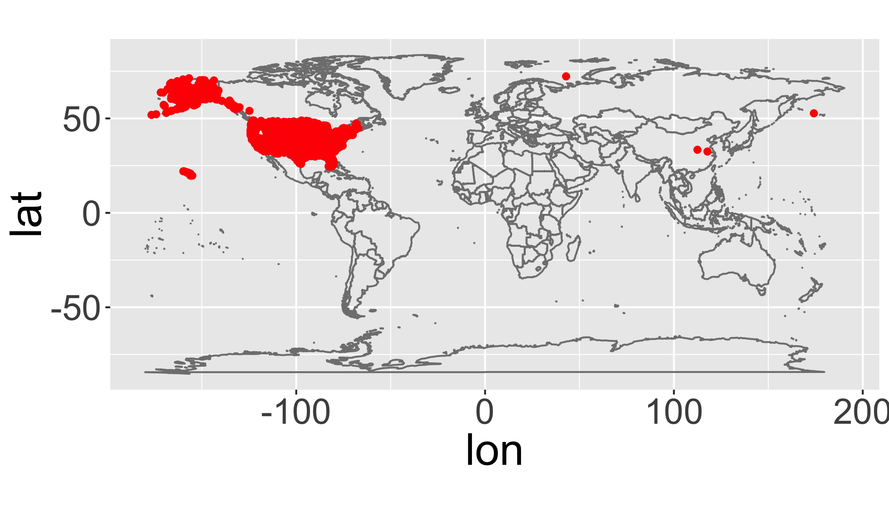
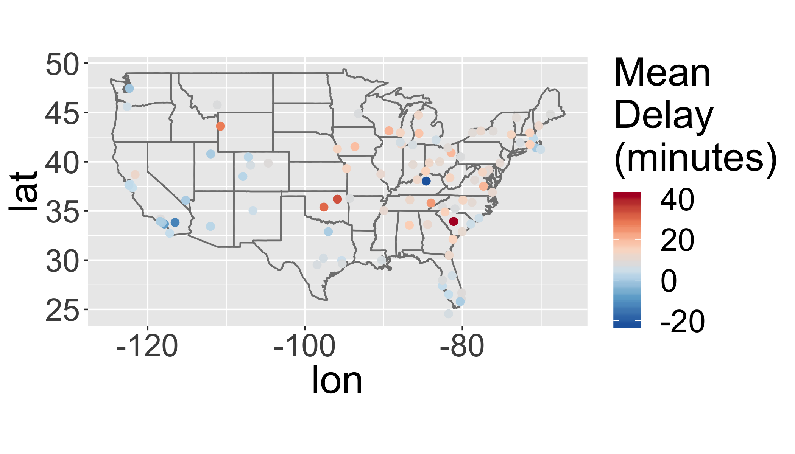

# Reading

- R4DS [Chapter 13 - Relational Data](http://r4ds.had.co.nz/relational-data.html){target='blank'}

# Tasks

- Join two datasets using a common column
- Answer a question that requires understanding relational table
- Save your script as a .R or .Rmd in your course repository


# Background
In this exercise you will use various data wrangling tools to answer questions from the data held in separate tables.  We'll use the data in the `nycflights13` package which has relationships between the tables as follows.


Your question: What is the full name (not the three letter code) of the destination airport farthest from the NYC airport?

# Instructions

Load the necessary packages

```r
library(tidyverse)
library(nycflights13)
```

### Detailed Steps

There are several ways to do this using at least two different joins.  The details below describe one way.

1. Look at the contents of the various tables to find the ones you need (`name`, `distance`, and `dest`).  You can use `head()`, `glimpse()`, `View()`, `str()`.  
2. In the table with distances, find the airport code that is farthest from the New York Airports (perhaps using `arrange()` and `slice()`)
3. Join this table with the one that has the full airport names.  You will either need to rename the columns so they match the other table or use the `by` parameter in the join.  e.g. check out `?left_join()`
4. `select()` only the `destName` column

I found two solutions that use 5 or 6 functions separated by pipes (`%>%`).  Can you do it in fewer?


## Extra Activities

Soon we will introduce working with spatial data and doing similar kinds of operations.  If you have time to play, see if you can figure out what this does:


```r
airports %>%
  distinct(lon,lat) %>%
  ggplot(aes(lon, lat)) +
    borders("world") +
    geom_point(col="red") +
    coord_quickmap()
```

<!-- -->

Can you figure out how to map mean delays by destination airport as shown below?

<!-- -->

<i> <small> Adapted from [R for Data Science](http://r4ds.had.co.nz/relational-data.html#filtering-joins) </small> </i>
