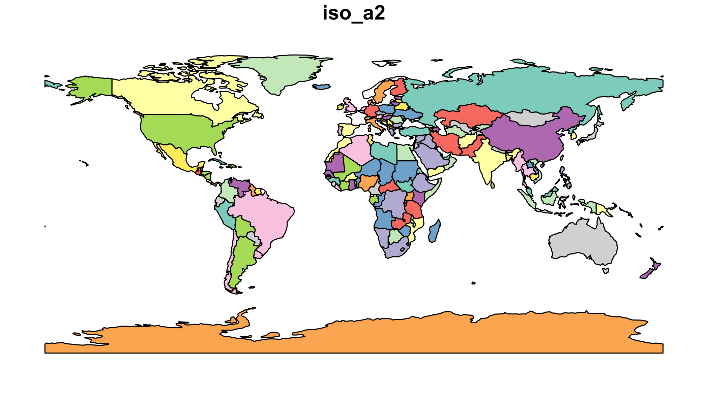
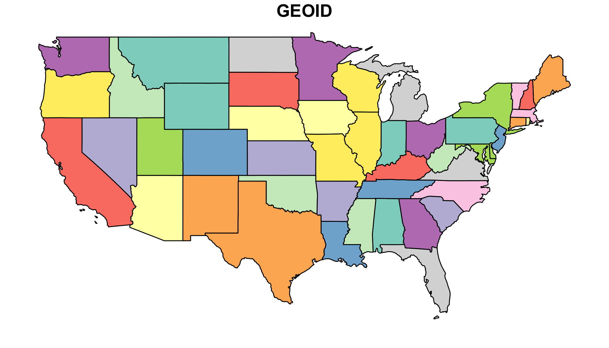
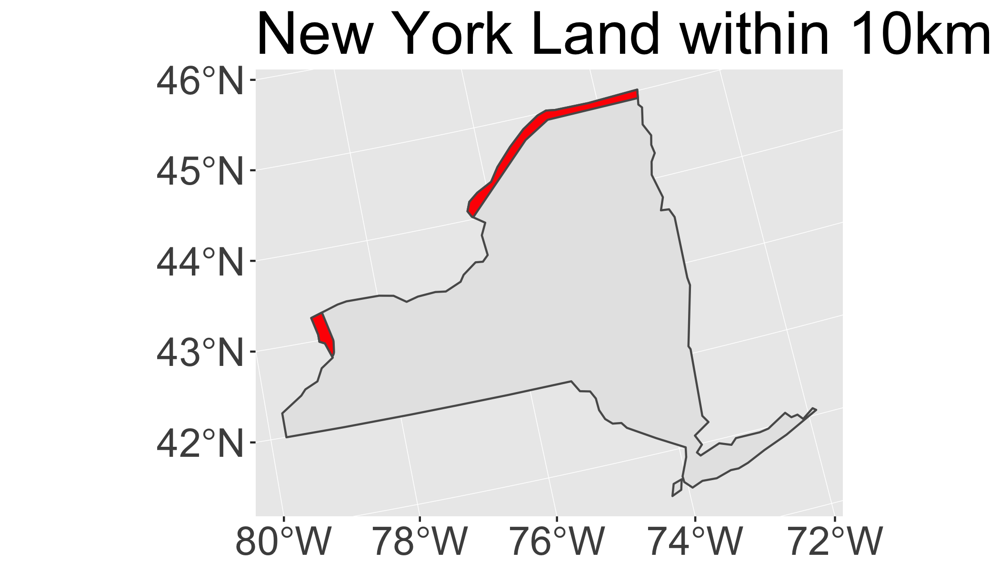

# Reading

- R4DS [Chapter 13 - Relational Data](http://r4ds.had.co.nz/relational-data.html){target='blank'}

# Background
Up to this point, we have dealt with data that fits into the tidy format without much effort. Spatial data has many complicating factors that have made handling spatial data in R complicated. Big strides are being made to make spatial data tidy in R. 


# Objective

You woke up in the middle of the night after a bad dream terrified of the Canadians.  You decide to start you are going to start a militia to defend the border.  But where should you defend?

> Generate a polygon that includes all land in NY that is within 10km of the Canadian border and calculate it's area.  How much area will you need to defend from the Canadians?


# Tasks

- NULL
- Save your script as a .R or .Rmd in your course repository

[<i class="fa fa-file-code-o fa-1x" aria-hidden="true"></i> Download starter R script (if desired)](scripts/CS_05_nocomments.R){target="_blank"}


<div class="well">
<button data-toggle="collapse" class="btn btn-primary btn-sm round" data-target="#demo1">Show Hints</button>
<div id="demo1" class="collapse">
The details below describe one possible approach.

You will need to load the foillowing packages

```r
library(maps)
library(ggplot2)
library(spData)
library(dplyr)
library(sf)
# library(units) #this one is optional, but can help with unit conversions.
```

And datasets:

```r
#load 'world' data from spData package
data(world) 
# load 'states' boundaries
states <- sf::st_as_sf(maps::map("state", plot = FALSE, fill = TRUE)) 

plot(world[1])
```

<!-- -->

```r
plot(states)
```

<!-- -->

## Projection


```r
albers="+proj=aea +lat_1=29.5 +lat_2=45.5 +lat_0=37.5 +lon_0=-96 +x_0=0 +y_0=0 +ellps=GRS80 +datum=NAD83 +units=m +no_defs "
```


1. `world` dataset
    1. transform to the albers equal area projection defined above as `albers`
    2. rename the `geom` column as `geometry` to make it easier to use `ggplot()`
    3. filter the world dataset to include only `name_long=="Canada"` 
    4. buffer canada to 10km (10000m)
2. `states` object    
    1. transform to the albers equal area projection defined above as `albers`
    2. filter the `states` dataset to include only `ID == "new york"`
    3. confirm that the filtered object is valid with `st_is_valid()`, if not, use `st_buffer(0)` to apply a zero-width buffer which can solve most validity problems
3. create a 'border' object
    1. use `st_intersection()` to intersect the canada buffer with New York (this will be your final polygon)
    2. use `st_area()` to calculate the area of this polygon.

</div>
</div>

Your final result should look like this:

<!-- -->

```
## 3231.416 km^2
```


Important note:  This is a crude dataset meant simply to illustrate the use of intersections and buffers.  The two datasets are not adequate for a highly accurate analysis.

<div class="extraswell">
<button data-toggle="collapse" class="btn btn-link" data-target="#extras">
Extra time? Try these extra activities...
</button>
<div id="extras" class="collapse">

Build a leaflet map of the same dataset.


<iframe id="test"  style=" height:400px; width:100%;" scrolling="no"  frameborder="0" src="CS05_leaflet.html"></iframe>


</div>
</div>
