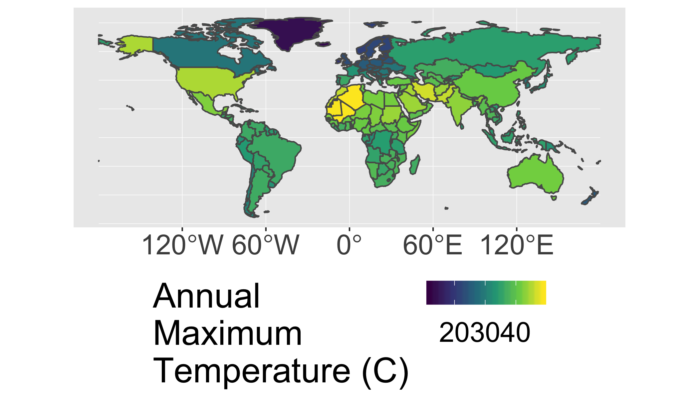

# Reading

- Raster Vector Interactions [GCR](https://geocompr.robinlovelace.net/geometric-operations.html#raster-vector){target='blank'}

# Background
The raster data format is commonly used for environmental datasets such as elevation, climate, soil, and land cover. We commonly need to `extract` the data from raster objects using simple features (vector objects).  For example if you had a set of points you collected using a GPS and wanted to know the mean annual temperature at each point, you might `extract` the data from each location in a raster-based map of temperature.


You could also be interested in some summary of the raster data across multiple pixels (such as the buffered points above, a transect, or within a polygon).  For example, you might be interested in the mean elevation within the entire polygon in the above figure.

In this case study we'll work with a timeseries of temperature data from [WorldClim](http://worldclim.org).  These are near-global rasters of various climatic variables available at several resolutions.  For convenience, we'll work with the very coarse data (0.5 degree, which is about 50km), but much finer data are available (~1km).  

# Objective
> Identify the hottest country on each continent (not counting Antarctica) by intersecting a set of polygons with a raster image and calculating the maximum raster value in each polygon.

# Tasks

- Calculate annual maximum temperatures from a monthly spatio-temporal dataset
- Remove Antarctica from the `world` dataset
- Summarize raster values within polygons
- Generate a summary figure and table.
- Save your script as a .R or .Rmd in your course repository

[<i class="fa fa-file-code-o fa-1x" aria-hidden="true"></i> Download starter R script (if desired)](scripts/CS_06_nocomments.R){target="_blank"}.  Save this directly to your course folder (repository) so you don't lose track of it!

<div class="well">
<button data-toggle="collapse" class="btn btn-primary btn-sm round" data-target="#demo1">Show Hints</button>
<div id="demo1" class="collapse">
The details below describe one possible approach.

## Libraries
You will need to load the following packages

```r
library(raster)
library(sf)
library(sp)
library(spData)
library(tidyverse)
```

Loading the `spData()` package may return a warning: `To access larger datasets...install spDataLarge...`.  This is not required - you can use the standard lower resolution files and safely ignore this message.

## Data

```r
data(world)  #load 'world' data from spData package
tmax_monthly <- getData(name = "worldclim", var="tmax", res=10)
```

## Steps
1. Prepare country polygon data (the `world` object).
    1. Remove "Antarctica" with `filter()` because WorldClim does not have data there.
    2. Convert the `world` object to `sp` format (the 'old' format) because the `raster` package doesn't accept `sf` objects.  you can do this with `as(world,"Spatial")`.
2. Prepare Climate Data 
    1. Download and load the WorldClim maximum temperature dataset at the lowest resolution (10 degrees) using the code above (`tmax_monthly=getData(...)`).
    2. Inspect the new `tmax_monthly` object (you can start by just typing it's name `tmax_monthly`, then perhaps making a `plot()`).  How many layers does it have?  What do these represent?  What are the units?  You can read more about the data [here](http://worldclim.org/formats1)
    3. Set the appropriate `gain()` to convert to Degrees C.  You can figure this out using information found [here](http://worldclim.org/formats1) and `?gain()`.  What value do you need to multiply with the data to get degrees C?
    3. Create a new object called `tmax_annual` that is the annual maximum temperature in each pixel of the raster stack using `max()`.  This will find the maximum temperature in each location across all months.
    4. Use `names(tmax_annual) <- "tmax"` to change the name of the layer in the new `tmax_annual` object to `tmax`. This makes the later code more intuitive than keeping the default name `layer`.
2. Calculate the maximum temperature observed in each country.
    1. use `raster::extract()` to identify the maximum temperature observed in each country (`fun=max`). Also set `na.rm=T, small=T, sp=T` to 1) handle missing data along coastlines, 2) account for small countries that may not have a full 0.5 degree pixel in them, and 3) return a spatial polygon object instead of just a vector of values.
    2. convert the results of the previous step to `sf` format with `st_as_sf()`.  Now you have an updated polygon object with a new column of maximium temperature.  Cool!
3. Communicate your results
    1. use `ggplot()` and `geom_sf()` to plot the maximum temperature in each country polygon (not the original raster layer).  To recreate the image below, you will also need `+scale_fill_viridis_c(name="Annual\nMaximum\nTemperature (C)")`.  Note the use of `\n` to insert a line break in the text string. You can move the legend around with `+theme(legend.position = 'bottom')`.
    2. use `dplyr` tools to find the hottest country in each continent. You may need `group_by()` and `top_n`.  To create a nice looking table, you may also want to use `select()` to keep only the desired columns, `arrange()` to sort them, `st_set_geometry(NULL)` to drop the geometry column (if desired).
</div>
</div>

Your final result should look something like this:

<!-- -->

And the summary table will look like this:

name_long                             continent                  tmax
------------------------------------  ------------------------  -----
Algeria                               Africa                     48.9
Iran                                  Asia                       46.7
United States                         North America              44.8
Australia                             Oceania                    41.8
Argentina                             South America              36.5
Spain                                 Europe                     36.1
French Southern and Antarctic Lands   Seven seas (open ocean)    11.8

Note that these data are based on 0.5 degree resolution data and thus will miss small hot places and cannot be directly compared with station-based data.  

<div class="extraswell">
<button data-toggle="collapse" class="btn btn-link" data-target="#extras">
Extra time? Try this...
</button>
<div id="extras" class="collapse">

Build a [leaflet map](https://rstudio.github.io/leaflet/) of the same dataset.


<iframe id="test"  style=" height:400px; width:100%;" scrolling="no"  frameborder="0" src="CS06_leaflet.html"></iframe>


</div>
</div>
