# Climate Metrics from daily weather data


[<i class="fa fa-file-code-o fa-3x" aria-hidden="true"></i> The R Script associated with this page is available here](08_WeatherData.R).  Download this file and open it (or copy-paste into a new script) with RStudio so you can follow along.  

# Summary

* Access and work with station weather data from Global Historical Climate Network (GHCN)  
* Explore options for plotting timeseries
* Trend analysis
* Compute Climate Extremes

# Climate Metrics

## Climate Metrics: ClimdEX
Indices representing extreme aspects of climate derived from daily data:


Climate Change Research Centre (CCRC) at University of New South Wales (UNSW) ([climdex.org](http://www.climdex.org)).  

### 27 Core indices

For example:

* **FD** Number of frost days: Annual count of days when TN (daily minimum temperature) < 0C.
* **SU** Number of summer days: Annual count of days when TX (daily maximum temperature) > 25C.
* **ID** Number of icing days: Annual count of days when TX (daily maximum temperature) < 0C.
* **TR** Number of tropical nights: Annual count of days when TN (daily minimum temperature) > 20C.
* **GSL** Growing season length: Annual (1st Jan to 31st Dec in Northern Hemisphere (NH), 1st July to 30th June in Southern Hemisphere (SH)) count between first span of at least 6 days with daily mean temperature TG>5C and first span after July 1st (Jan 1st in SH) of 6 days with TG<5C.
* **TXx** Monthly maximum value of daily maximum temperature
* **TN10p** Percentage of days when TN < 10th percentile
* **Rx5day** Monthly maximum consecutive 5-day precipitation
* **SDII** Simple pricipitation intensity index


# Weather Data

### Climate Data Online

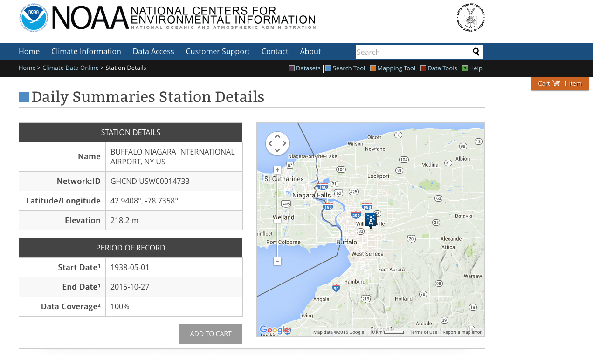

### GHCN 


## Options for downloading data

### `FedData` package

* National Elevation Dataset digital elevation models (1 and 1/3 arc-second; USGS)
* National Hydrography Dataset (USGS)
* Soil Survey Geographic (SSURGO) database 
* International Tree Ring Data Bank.
* *Global Historical Climatology Network* (GHCN)

### NOAA API

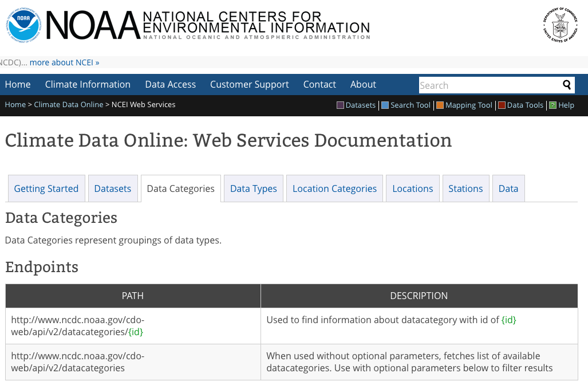

[National Climatic Data Center application programming interface (API)]( http://www.ncdc.noaa.gov/cdo-web/webservices/v2). 

### `rNOAA` package

Handles downloading data directly from NOAA APIv2.

* `buoy_*`  NOAA Buoy data from the National Buoy Data Center
* `ghcnd_*`  GHCND daily data from NOAA
* `isd_*` ISD/ISH data from NOAA
* `homr_*` Historical Observing Metadata Repository
* `ncdc_*` NOAA National Climatic Data Center (NCDC)
* `seaice` Sea ice
* `storm_` Storms (IBTrACS)
* `swdi` Severe Weather Data Inventory (SWDI)
* `tornadoes` From the NOAA Storm Prediction Center

---

### Libraries


```r
library(raster)
library(sp)
library(rgdal)
library(ggplot2)
library(ggmap)
library(dplyr)
library(tidyr)
library(maps)
# New Packages
library(rnoaa)
library(climdex.pcic)
library(zoo)
library(reshape2)
```

### Station locations 

Download the GHCN station inventory with `ghcnd_stations()`.  


```r
datadir="data"

st = ghcnd_stations()

## Optionally, save it to disk
# write.csv(st,file.path(datadir,"st.csv"))
## If internet fails, load the file from disk using:
# st=read.csv(file.path(datadir,"st.csv"))
```

### GHCND Variables

5 core values:

* **PRCP** Precipitation (tenths of mm)
* **SNOW** Snowfall (mm)
* **SNWD** Snow depth (mm)
* **TMAX** Maximum temperature
* **TMIN** Minimum temperature

And ~50 others!  For example:

* **ACMC** Average cloudiness midnight to midnight from 30-second ceilometer 
* **AWND** Average daily wind speed
* **FMTM** Time of fastest mile or fastest 1-minute wind
* **MDSF** Multiday snowfall total


### `filter()` to temperature and precipitation

```r
st=dplyr::filter(st,element%in%c("TMAX","TMIN","PRCP"))
```

### Map GHCND stations

First, get a global country polygon

```r
worldmap=map_data("world")
```

Plot all stations:

```r
ggplot(data=st,aes(y=latitude,x=longitude)) +
  facet_grid(element~.)+
  annotation_map(map=worldmap,size=.1,fill="grey",colour="black")+
  geom_point(size=.1,col="red")+
  coord_equal()
```

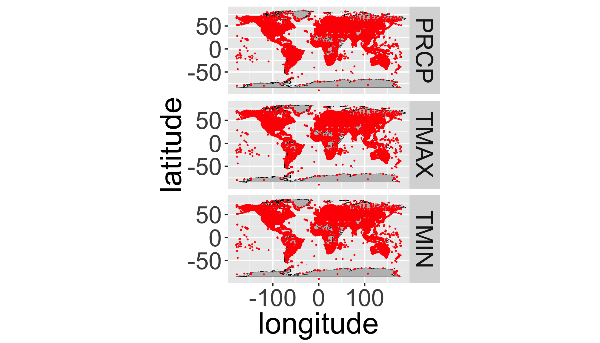<!-- -->

It's hard to see all the points, let's bin them...


```r
ggplot(st,aes(y=latitude,x=longitude)) +
  annotation_map(map=worldmap,size=.1,fill="grey",colour="black")+
  facet_grid(element~.)+
  stat_bin2d(bins=100)+
  scale_fill_distiller(palette="YlOrRd",trans="log",direction=-1,
                       breaks = c(1,10,100,1000))+
  coord_equal()
```

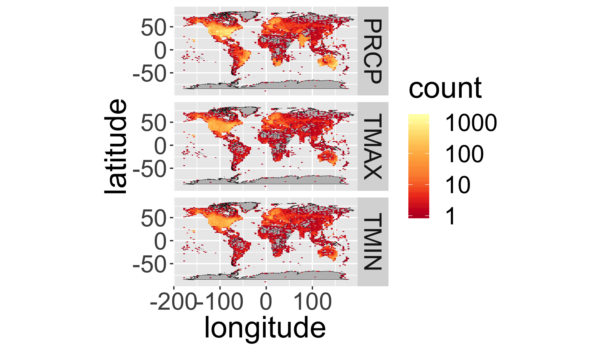<!-- -->
<div class="well">
## Your turn

Produce a binned map (like above) with the following modifications:

* include only stations with data between 1950 and 2000
* include only `tmax`

<button data-toggle="collapse" class="btn btn-primary btn-sm round" data-target="#demo1">Show Solution</button>
<div id="demo1" class="collapse">


```r
ggplot(filter(st,
              first_year<=1950 & 
              last_year>=2000 & 
              element=="TMAX"),
       aes(y=latitude,x=longitude)) +
  annotation_map(map=worldmap,size=.1,fill="grey",colour="black")+
  stat_bin2d(bins=75)+
  scale_fill_distiller(palette="YlOrRd",trans="log",direction=-1,
    breaks = c(1,10,50))+
  coord_equal()
```

<!-- -->
</div>
</div>

## Download daily data from GHCN

`ghcnd()` will download a `.dly` file for a particular station.  But how to choose?

### `geocode` in ggmap package useful for geocoding place names 
Geocodes a location (find latitude and longitude) using either (1) the Data Science Toolkit (http://www.datasciencetoolkit.org/about) or (2) Google Maps. 


```r
geocode("University at Buffalo, NY")
```

```
## Information from URL : http://maps.googleapis.com/maps/api/geocode/json?address=University%20at%20Buffalo,%20NY&sensor=false
```

```
##         lon      lat
## 1 -78.82296 42.95382
```

However, you have to be careful:

```r
geocode("My Grandma's house")
```

```
## Information from URL : http://maps.googleapis.com/maps/api/geocode/json?address=My%20Grandma's%20house&sensor=false
```

```
##        lon      lat
## 1 118.3912 31.30682
```

But this is pretty safe for well known places.

```r
coords=as.matrix(geocode("Buffalo, NY"))
```

```
## Information from URL : http://maps.googleapis.com/maps/api/geocode/json?address=Buffalo,%20NY&sensor=false
```

```r
coords
```

```
##            lon      lat
## [1,] -78.87837 42.88645
```

Now use that location to spatially filter stations with a rectangular box.

```r
dplyr::filter(st,
              grepl("BUFFALO",name)&
              between(latitude,coords[2]-1,coords[2]+1) &
              between(longitude,coords[1]-1,coords[1]+1)&
         element=="TMAX")
```

```
## # A tibble: 3 × 11
##            id latitude longitude elevation state       name gsn_flag
##         <chr>    <dbl>     <dbl>     <dbl> <chr>      <chr>    <chr>
## 1 USC00301010  42.8833  -78.8833    -999.9    NY    BUFFALO         
## 2 USC00301018  42.9333  -78.9000     177.1    NY BUFFALO #2         
## 3 USW00014733  42.9486  -78.7369     211.2    NY    BUFFALO         
## # ... with 4 more variables: wmo_id <chr>, element <chr>,
## #   first_year <int>, last_year <int>
```
You could also spatially filter using `over()` in sp package...


With the station ID, we can now download daily data from NOAA.

```r
d=meteo_tidy_ghcnd("USW00014733",
                   var = c("TMAX","TMIN","PRCP"),
                   keep_flags=T)
head(d)
```

```
## # A tibble: 6 × 14
##            id       date mflag_prcp mflag_tmax mflag_tmin  prcp qflag_prcp
##         <chr>     <date>      <chr>      <chr>      <chr> <dbl>      <chr>
## 1 USW00014733 1938-05-01          T                           0           
## 2 USW00014733 1938-05-02          T                           0           
## 3 USW00014733 1938-05-03                                     25           
## 4 USW00014733 1938-05-04                                    112           
## 5 USW00014733 1938-05-05          T                           0           
## 6 USW00014733 1938-05-06                                     64           
## # ... with 7 more variables: qflag_tmax <chr>, qflag_tmin <chr>,
## #   sflag_prcp <chr>, sflag_tmax <chr>, sflag_tmin <chr>, tmax <dbl>,
## #   tmin <dbl>
```

See [CDO Daily Description](http://www1.ncdc.noaa.gov/pub/data/cdo/documentation/GHCND_documentation.pdf) and raw [GHCND metadata](http://www1.ncdc.noaa.gov/pub/data/ghcn/daily/readme.txt) for more details.  If you want to download multiple stations at once, check out `meteo_pull_monitors()`

### Quality Control: MFLAG

Measurement Flag/Attribute

* **Blank** no measurement information applicable
* **B** precipitation total formed from two twelve-hour totals
* **H** represents highest or lowest hourly temperature (TMAX or TMIN) or average of hourly values (TAVG)
* **K** converted from knots
* ...

See [CDO Description](http://www1.ncdc.noaa.gov/pub/data/cdo/documentation/GHCND_documentation.pdf) 

### Quality Control: QFLAG

* **Blank** did not fail any quality assurance check 
* **D** failed duplicate check
* **G** failed gap check
* **K** failed streak/frequent-value check
* **N** failed naught check
* **O** failed climatological outlier check
* **S** failed spatial consistency check
* **T** failed temporal consistency check
* **W** temperature too warm for snow
* ...

See [CDO Description](http://www1.ncdc.noaa.gov/pub/data/cdo/documentation/GHCND_documentation.pdf) 

### Quality Control: SFLAG

Indicates the source of the data...

## Summarize QC flags

Summarize the QC flags.  How many of which type are there?  Should we be more conservative?


```r
table(d$qflag_tmax)  
```

```
## 
##           G     I 
## 28662     2    10
```

```r
table(d$qflag_tmin)  
```

```
## 
##           G     I     S 
## 28661     2     7     4
```

```r
table(d$qflag_prcp)  
```

```
## 
##           G 
## 28673     1
```
* **T** failed temporal consistency check

#### Filter with QC data and change units

```r
d_filtered=d%>%
  mutate(tmax=ifelse(qflag_tmax!=" "|tmax==-9999,NA,tmax/10))%>%  # convert to degrees C
  mutate(tmin=ifelse(qflag_tmin!=" "|tmin==-9999,NA,tmin/10))%>%  # convert to degrees C
  mutate(prcp=ifelse(qflag_tmin!=" "|prcp==-9999,NA,prcp))%>%  # convert to degrees C
  arrange(date)
```

Plot temperatures

```r
ggplot(d_filtered,
       aes(y=tmax,x=date))+
  geom_line(col="red")
```

```
## Warning: Removed 10 rows containing missing values (geom_path).
```

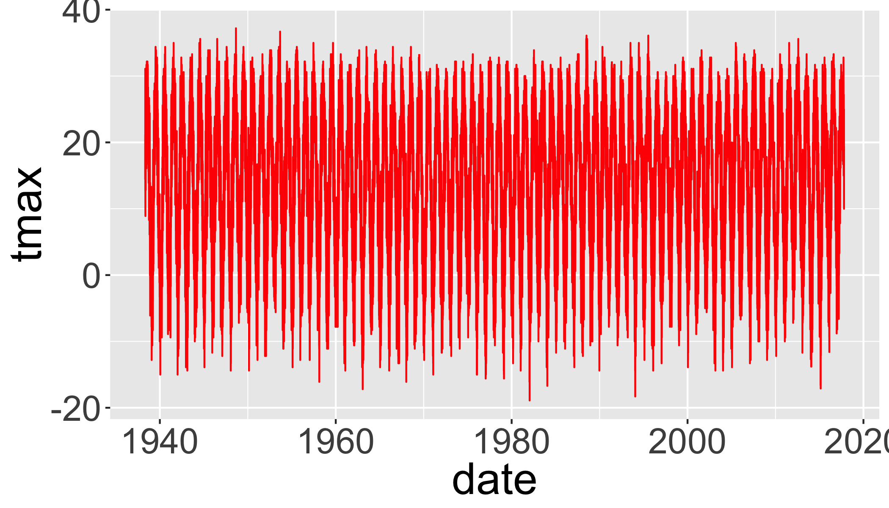<!-- -->

Limit to a few years and plot the daily range and average temperatures.

```r
d_filtered_recent=filter(d_filtered,date>as.Date("2013-01-01"))

  ggplot(d_filtered_recent,
         aes(ymax=tmax,ymin=tmin,x=date))+
    geom_ribbon(col="grey",fill="grey")+
    geom_line(aes(y=(tmax+tmin)/2),col="red")
```

```
## Warning: Removed 10 rows containing missing values (geom_path).
```

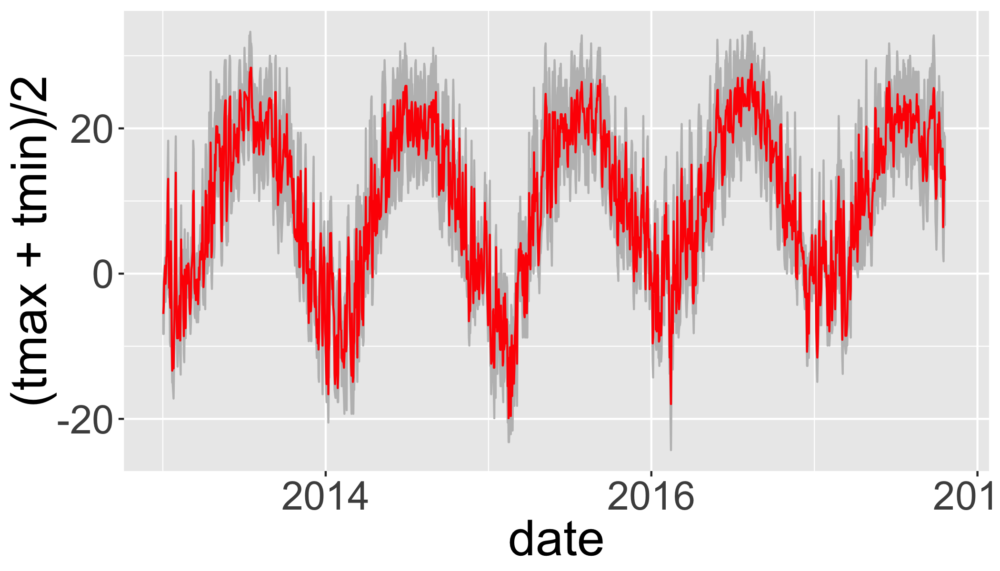<!-- -->

### Zoo package for rolling functions

Infrastructure for Regular and Irregular Time Series (Z's Ordered Observations)

* `rollmean()`:  Rolling mean
* `rollsum()`:   Rolling sum
* `rollapply()`:  Custom functions

Use rollmean to calculate a rolling 60-day average. 

* `align` whether the index of the result should be left- or right-aligned or centered


```r
d_rollmean = d_filtered_recent %>% 
  arrange(date) %>%
  mutate(tmax.60 = rollmean(x = tmax, 60, align = "center", fill = NA),
         tmax.b60 = rollmean(x = tmax, 60, align = "right", fill = NA))
```


```r
d_rollmean%>%
  ggplot(aes(ymax=tmax,ymin=tmin,x=date))+
    geom_ribbon(fill="grey")+
    geom_line(aes(y=(tmin+tmax)/2),col=grey(0.4),size=.5)+
    geom_line(aes(y=tmax.60),col="red")+
    geom_line(aes(y=tmax.b60),col="darkred")
```

```
## Warning: Removed 10 rows containing missing values (geom_path).
```

```
## Warning: Removed 72 rows containing missing values (geom_path).

## Warning: Removed 72 rows containing missing values (geom_path).
```

<!-- -->

<div class="well">
## Your Turn

Plot a 30-day rolling "right" aligned sum of precipitation.

<button data-toggle="collapse" class="btn btn-primary btn-sm round" data-target="#demo2">Show Solution</button>
<div id="demo2" class="collapse">

```r
tp=d_filtered_recent %>%
  arrange(date)  %>% 
  mutate(prcp.30 = rollsum(x = prcp, 30, align = "right", fill = NA))

ggplot(tp,aes(y=prcp,x=date))+
  geom_line(aes(y=prcp.30),col="black")+ 
  geom_line(col="red") 
```

```
## Warning: Removed 42 rows containing missing values (geom_path).
```

```
## Warning: Removed 10 rows containing missing values (geom_path).
```

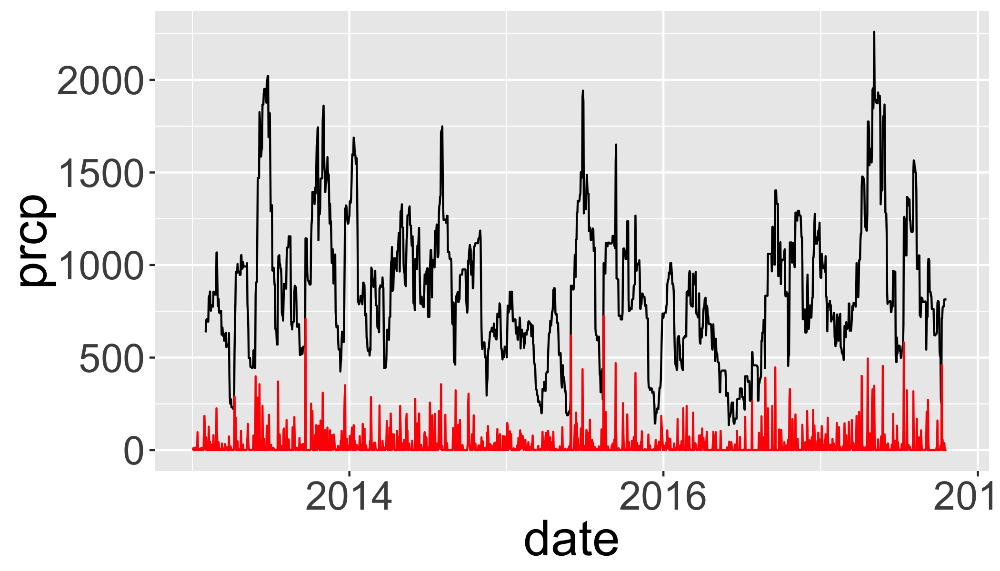<!-- -->
</div>
</div>


# Time Series analysis

Most timeseries functions use the time series class (`ts`)


```r
tmin.ts=ts(d_filtered_recent$tmin,frequency = 365)
```

## Temporal autocorrelation

Values are highly correlated!


```r
ggplot(d_filtered_recent,aes(y=tmin,x=lag(tmin)))+
  geom_point()+
  geom_abline(intercept=0, slope=1)
```

```
## Warning: Removed 13 rows containing missing values (geom_point).
```

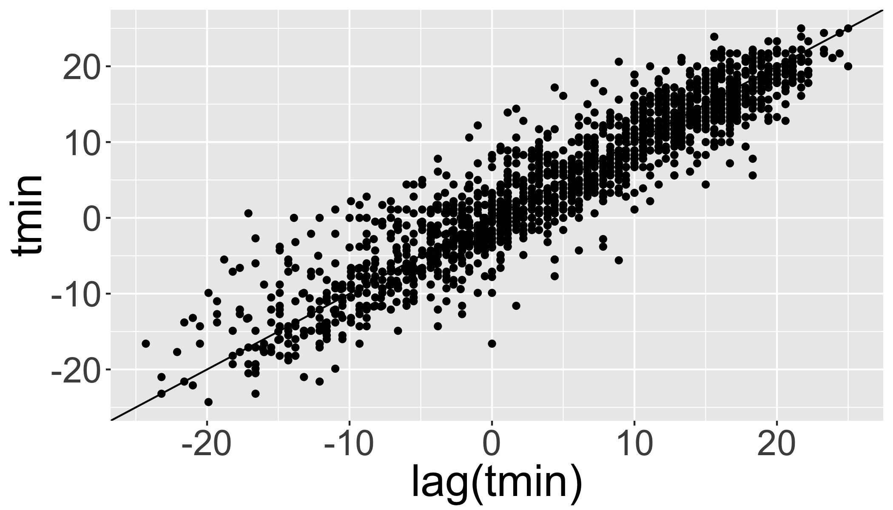<!-- -->

### Autocorrelation functions

* autocorrelation  $x$ vs. $x_{t-1}$  (lag=1)
* partial autocorrelation.  $x$  vs. $x_{n}$ _after_ controlling for correlations $\in t-1:n$

#### Autocorrelation

```r
acf(tmin.ts,lag.max = 365*3,na.action = na.exclude )
```

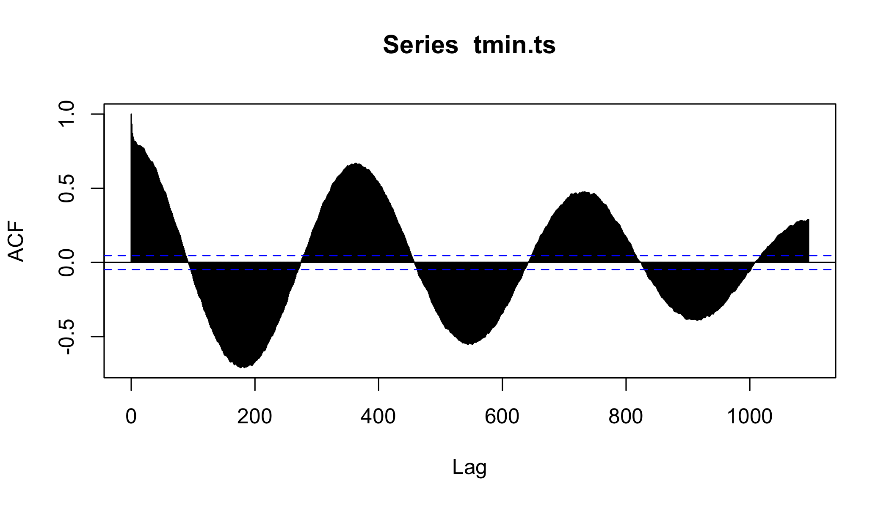<!-- -->

#### Partial Autocorrelation

```r
pacf(tmin.ts,lag.max = 365*3,na.action = na.exclude )
```

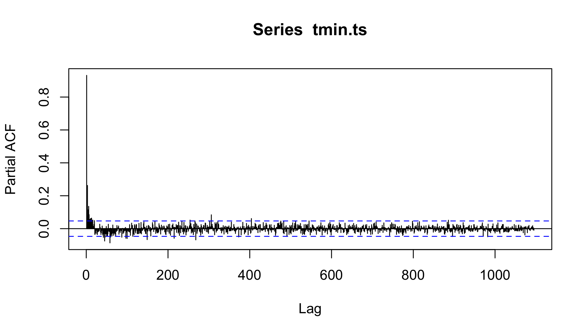<!-- -->


# Checking for significant trends

## Compute temporal aggregation indices

### Group by month, season, year, and decade.

How to convert years into 'decades'?

```r
1938
```

```
## [1] 1938
```

```r
round(1938,-1)
```

```
## [1] 1940
```

```r
floor(1938/10)*10
```

```
## [1] 1930
```


```r
d_filtered2=d_filtered%>%
  mutate(month=as.numeric(format(date,"%m")),
        year=as.numeric(format(date,"%Y")),
        season=ifelse(month%in%c(12,1,2),"Winter",
            ifelse(month%in%c(3,4,5),"Spring",
              ifelse(month%in%c(6,7,8),"Summer",
                ifelse(month%in%c(9,10,11),"Fall",NA)))),
        dec=(floor(as.numeric(format(date,"%Y"))/10)*10))
head(d_filtered2)
```

```
## # A tibble: 6 × 18
##            id       date mflag_prcp mflag_tmax mflag_tmin  prcp qflag_prcp
##         <chr>     <date>      <chr>      <chr>      <chr> <dbl>      <chr>
## 1 USW00014733 1938-05-01          T                           0           
## 2 USW00014733 1938-05-02          T                           0           
## 3 USW00014733 1938-05-03                                     25           
## 4 USW00014733 1938-05-04                                    112           
## 5 USW00014733 1938-05-05          T                           0           
## 6 USW00014733 1938-05-06                                     64           
## # ... with 11 more variables: qflag_tmax <chr>, qflag_tmin <chr>,
## #   sflag_prcp <chr>, sflag_tmax <chr>, sflag_tmin <chr>, tmax <dbl>,
## #   tmin <dbl>, month <dbl>, year <dbl>, season <chr>, dec <dbl>
```

## Timeseries models


How to assess change? Simple differences?


```r
d_filtered2%>%
  mutate(period=ifelse(year<=1976-01-01,"early","late"))%>%
  group_by(period)%>%
  summarize(n=n(),
            tmin=mean(tmin,na.rm=T),
            tmax=mean(tmax,na.rm=T),
            prcp=mean(prcp,na.rm=T))
```

```
## # A tibble: 2 × 5
##   period     n     tmin     tmax     prcp
##    <chr> <int>    <dbl>    <dbl>    <dbl>
## 1  early 13394 4.199753 13.67348 25.07871
## 2   late 15280 4.732831 13.73153 28.35412
```

#### Summarize by season

```r
seasonal=d_filtered2%>%
  group_by(year,season)%>%
  summarize(n=n(),
            tmin=mean(tmin),
            tmax=mean(tmax),
            prcp=mean(prcp))%>%
  filter(n>75)

ggplot(seasonal,aes(y=tmin,x=year))+
  facet_grid(season~.,scales = "free_y")+
  stat_smooth(method="lm", se=T)+
  geom_line()
```

```
## Warning: Removed 12 rows containing non-finite values (stat_smooth).
```

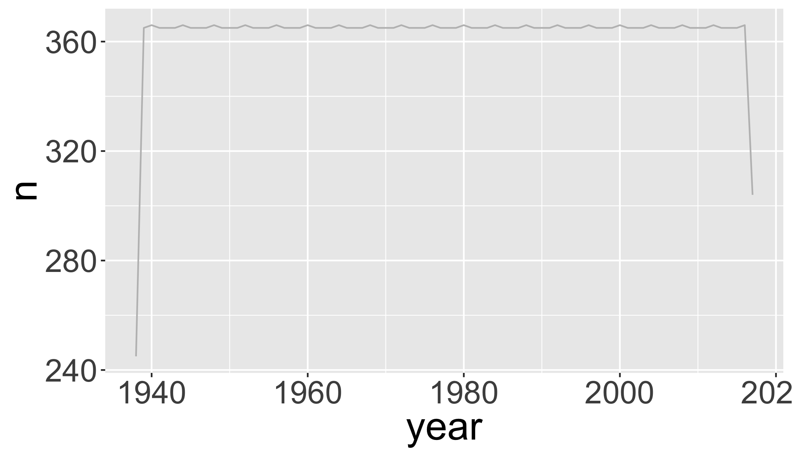<!-- -->

### Kendal Seasonal Trend Test

Nonparametric seasonal trend analysis. 

e.g. [Hirsch-Slack test](http://onlinelibrary.wiley.com/doi/10.1029/WR020i006p00727)


```r
library(EnvStats)
```

```
## 
## Attaching package: 'EnvStats'
```

```
## The following objects are masked from 'package:raster':
## 
##     cv, predict, print
```

```
## The following objects are masked from 'package:stats':
## 
##     predict, predict.lm
```

```
## The following object is masked from 'package:base':
## 
##     print.default
```

```r
t1=kendallSeasonalTrendTest(tmax~season+year,data=seasonal)
t1
```

```
## 
## Results of Hypothesis Test
## --------------------------
## 
## Null Hypothesis:                 All 4 values of tau = 0
## 
## Alternative Hypothesis:          The seasonal taus are not all equal
##                                  (Chi-Square Heterogeneity Test)
##                                  At least one seasonal tau != 0
##                                  and all non-zero tau's have the
##                                  same sign (z Trend Test)
## 
## Test Name:                       Seasonal Kendall Test for Trend
##                                  (with continuity correction)
## 
## Estimated Parameter(s):          tau       = 0.021608882
##                                  slope     = 0.001660562
##                                  intercept = 4.548195250
## 
## Estimation Method:               tau:        Weighted Average of
##                                              Seasonal Estimates
##                                  slope:      Hirsch et al.'s
##                                              Modification of
##                                              Thiel/Sen Estimator
##                                  intercept:  Median of
##                                              Seasonal Estimates
## 
## Data:                            y      = tmax  
##                                  season = season
##                                  year   = year  
## 
## Data Source:                     seasonal
## 
## Sample Sizes:                    Fall   =  73
##                                  Summer =  79
##                                  Spring =  76
##                                  Winter =  73
##                                  Total  = 301
## 
## Number NA/NaN/Inf's:             11
## 
## Test Statistics:                 Chi-Square (Het) = 7.0880781
##                                  z (Trend)        = 0.5135024
## 
## Test Statistic Parameter:        df = 3
## 
## P-values:                        Chi-Square (Het) = 0.06914279
##                                  z (Trend)        = 0.60759991
## 
## Confidence Interval for:         slope
## 
## Confidence Interval Method:      Gilbert's Modification of
##                                  Theil/Sen Method
## 
## Confidence Interval Type:        two-sided
## 
## Confidence Level:                95%
## 
## Confidence Interval:             LCL = -0.004951691
##                                  UCL =  0.008524673
```

#### Minimum Temperature

```r
t2=kendallSeasonalTrendTest(tmin~season+year,data=seasonal)
t2
```

```
## 
## Results of Hypothesis Test
## --------------------------
## 
## Null Hypothesis:                 All 4 values of tau = 0
## 
## Alternative Hypothesis:          The seasonal taus are not all equal
##                                  (Chi-Square Heterogeneity Test)
##                                  At least one seasonal tau != 0
##                                  and all non-zero tau's have the
##                                  same sign (z Trend Test)
## 
## Test Name:                       Seasonal Kendall Test for Trend
##                                  (with continuity correction)
## 
## Estimated Parameter(s):          tau       =   0.2073749
##                                  slope     =   0.0170920
##                                  intercept = -27.3224921
## 
## Estimation Method:               tau:        Weighted Average of
##                                              Seasonal Estimates
##                                  slope:      Hirsch et al.'s
##                                              Modification of
##                                              Thiel/Sen Estimator
##                                  intercept:  Median of
##                                              Seasonal Estimates
## 
## Data:                            y      = tmin  
##                                  season = season
##                                  year   = year  
## 
## Data Source:                     seasonal
## 
## Sample Sizes:                    Fall   =  75
##                                  Summer =  78
##                                  Spring =  75
##                                  Winter =  72
##                                  Total  = 300
## 
## Number NA/NaN/Inf's:             12
## 
## Test Statistics:                 Chi-Square (Het) = 5.575224
##                                  z (Trend)        = 5.325074
## 
## Test Statistic Parameter:        df = 3
## 
## P-values:                        Chi-Square (Het) = 1.34208e-01
##                                  z (Trend)        = 1.00912e-07
## 
## Confidence Interval for:         slope
## 
## Confidence Interval Method:      Gilbert's Modification of
##                                  Theil/Sen Method
## 
## Confidence Interval Type:        two-sided
## 
## Confidence Level:                95%
## 
## Confidence Interval:             LCL = 0.01109957
##                                  UCL = 0.02258634
```

### Autoregressive models
See [Time Series Analysis Task View](https://cran.r-project.org/web/views/TimeSeries.html) for summary of available packages/models. 

* Moving average (MA) models
* autoregressive (AR) models
* autoregressive moving average (ARMA) models
* frequency analysis
* Many, many more...

-------

# Climate Metrics

### Climdex indices
[ClimDex](http://www.climdex.org/indices.html)

###  Format data for `climdex`


```r
library(PCICt)
## Parse the dates into PCICt.
pc.dates <- as.PCICt(as.POSIXct(d_filtered$date),cal="gregorian")
```


### Generate the climdex object

```r
  library(climdex.pcic)
    ci <- climdexInput.raw(
      tmax=d_filtered$tmax,
      tmin=d_filtered$tmin,
      prec=d_filtered$prcp,
      pc.dates,pc.dates,pc.dates, 
      base.range=c(1971, 2000))
years=as.numeric(as.character(unique(ci@date.factors$annual)))
```

### Cumulative dry days


```r
cdd= climdex.cdd(ci, spells.can.span.years = TRUE)
plot(cdd~years,type="l")
```

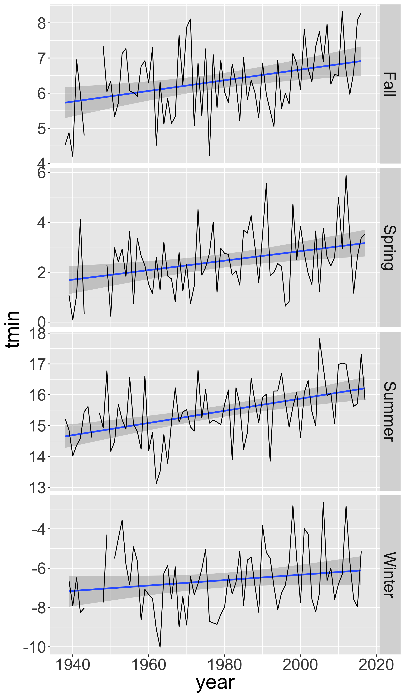<!-- -->

### Diurnal Temperature Range


```r
dtr=climdex.dtr(ci, freq = c("annual"))
plot(dtr~years,type="l")
```

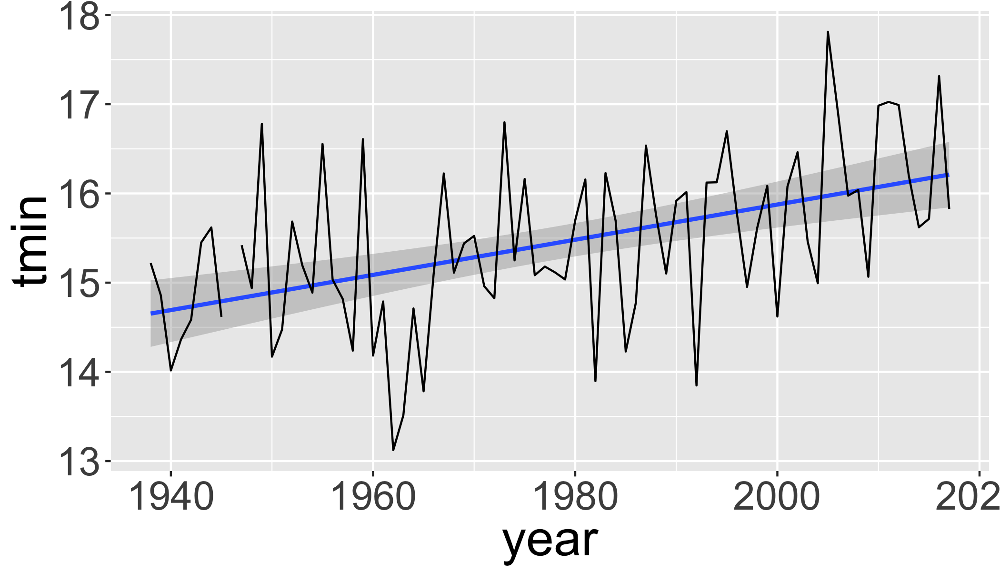<!-- -->

### Frost Days


```r
fd=climdex.fd(ci)
plot(fd~years,type="l")
```

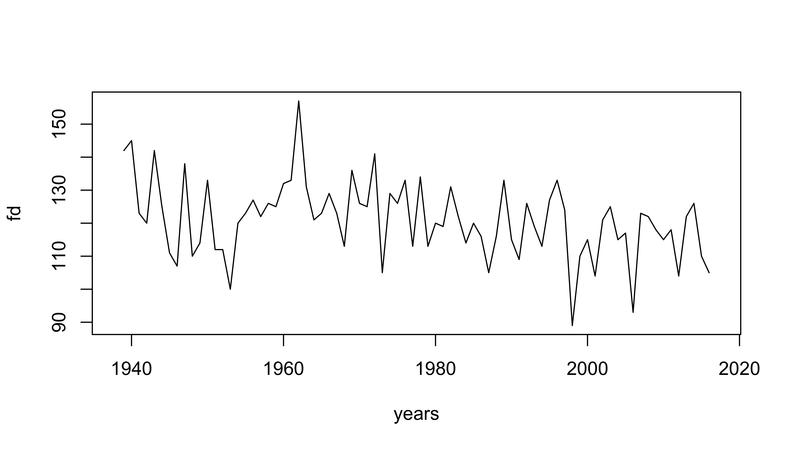<!-- -->

<div class="well">
## Your Turn

See all available indices with:

```r
climdex.get.available.indices(ci)
```

```
##  [1] "climdex.su"      "climdex.id"      "climdex.txx"    
##  [4] "climdex.txn"     "climdex.tx10p"   "climdex.tx90p"  
##  [7] "climdex.wsdi"    "climdex.fd"      "climdex.tr"     
## [10] "climdex.tnx"     "climdex.tnn"     "climdex.tn10p"  
## [13] "climdex.tn90p"   "climdex.csdi"    "climdex.rx1day" 
## [16] "climdex.rx5day"  "climdex.sdii"    "climdex.r10mm"  
## [19] "climdex.r20mm"   "climdex.rnnmm"   "climdex.cdd"    
## [22] "climdex.cwd"     "climdex.r95ptot" "climdex.r99ptot"
## [25] "climdex.prcptot" "climdex.gsl"     "climdex.dtr"
```

Select 3 indices, calculate them, and plot the timeseries.

<button data-toggle="collapse" class="btn btn-primary btn-sm round" data-target="#demo4">Show Solution</button>
<div id="demo4" class="collapse">


```r
r10mm=climdex.r10mm(ci)
plot(r10mm~years,type="l")
```

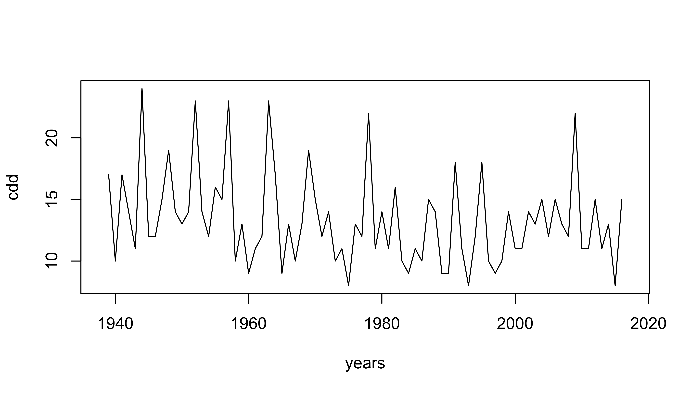<!-- -->

```r
prcptot=climdex.prcptot(ci)
plot(prcptot~years,type="l")
```

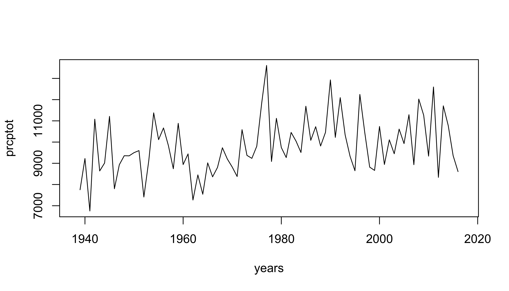<!-- -->

```r
gsl=climdex.gsl(ci)
plot(gsl~years,type="l")
```

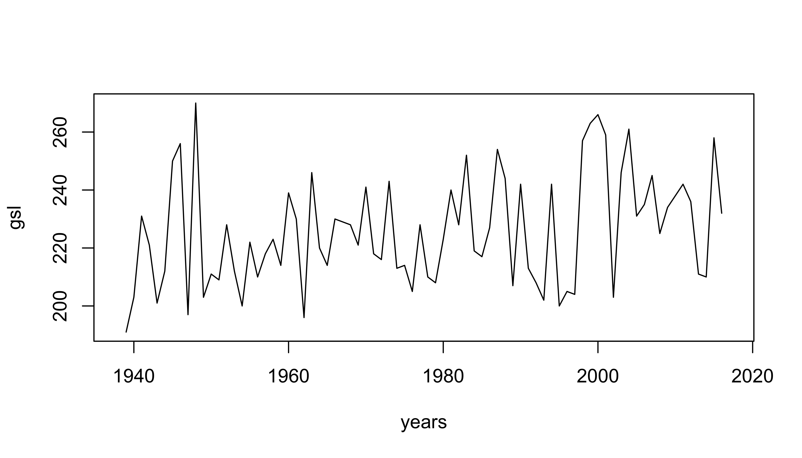<!-- -->

</div>
</div>


