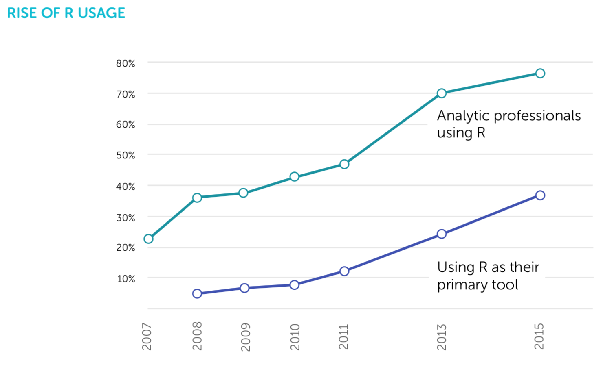
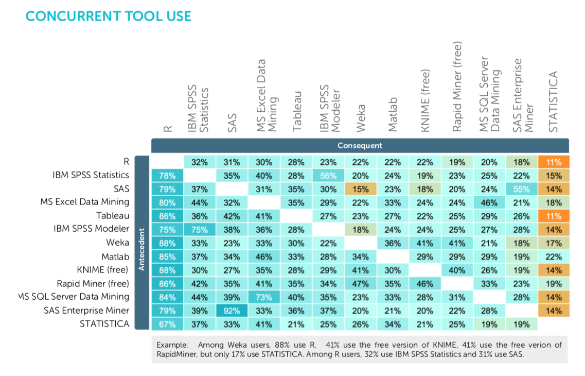

# Who uses R

## {data-background-iframe="http://r4stats.com/articles/popularity"}

[Popularity of Data Science Software](http://r4stats.com/articles/popularity)

## Software in Job Ads


The number of data science jobs for the more popular software (those with 250 jobs or more, 2/2017).

## Data science job trends


R (blue) and SAS (orange).


## Scholarly Articles


Number of scholarly articles found in the most recent complete year (2016) for the more popular data science software. To be included, software must be used in at least 750 scholarly articles.

## Trend in scholarly articles


The number of scholarly articles found in each year by Google Scholar. Only the top six “classic" statistics packages are shown.

## Trend in scholarly articles


The number of scholarly articles found in each year by Google Scholar for classic statistics packages after the curves for SPSS and SAS have been removed.
 
## Rexer's biannual Data Science Survey 


1,220 respondents from 72 different countries

## Tool Use


## Change over time


## Interface to R


# Getting Started

## Questions from the readings?


## Many 'Cheatsheets' available

https://www.rstudio.com/resources/cheatsheets/

## Basic R Data Structures

http://github.com/rstudio/cheatsheets/raw/master/base-r.pdf

## Data Transformation

https://github.com/rstudio/cheatsheets/raw/master/data-transformation.pdf

# Training your eyes

## Fix the errors

Do you see any errors in the following code?


```r
library(tidyverse)

ggplot(dota = mpg) + 
  geom_point(mapping = aes(x = displ, y = hwy))

fliter(mpg, cyl = 8)
filter(diamond, carat > 3)
```

## Interpret these error statements

Discuss with your neighbor what the error statement is saying. How would you fix it?


```r
ggplot(dota = mpg) + 
+   geom_point(mapping = aes(x = displ, y = hwy))
#> Error in structure(list(data = data, layers = list(), 
#> scales = scales_list(),  : 
#>  argument "data" is missing, with no default
```


```r
fliter(mpg, cyl = 8)
#> Error in fliter(mpg, cyl = 8) : could not find function "fliter"
```


```r
filter(diamond, carat > 3)
#> Error in filter(diamond, carat > 3) : object 'diamond' not found
```

## Let's get coding...

Open [today's activity](../01_Rintro.html) and work through the exercise.
