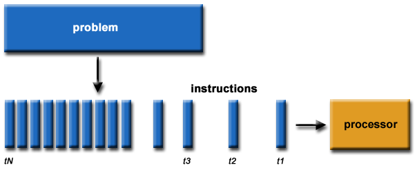

## Serial Computing
Most (legacy) software is written for serial computation:

  * Problem broken into discrete set of instructions
  * Instructions executed sequentially on a single processor
  

<br><span style="color:grey; font-size:0.5em;">Figure from [here](https://computing.llnl.gov/tutorials/parallel_comp/) </span>

## Parallel computation

  * Problem divided into discrete parts that can be solved concurrently
  * Instructions executed simultaneously on different processors
  * Overall control/coordination mechanism


<br><span style="color:grey; font-size:0.5em;">Figure from [here](https://computing.llnl.gov/tutorials/parallel_comp/) </span>


## Flynn's taxonomy
A classification of computer architectures ([Flynn, 1972](http://dx.doi.org/10.1109/TC.1972.5009071))

### Four Categories

1.  *Single Instruction, Single Data (SISD)*
    * No parallelization
2.  *Single Instruction, Multiple Data (SIMD)*
    * Run the same code/analysis on different datasets
    * Examples: 
         * different species in species distribution model
         * same species under different climates

---

3. *Multiple Instruction, Single Data (MISD)*
    * Run different code/analyses on the same data
    * Examples:
        * One species, multiple models
4. *Multiple Instruction, Multiple Data streams (MIMD)*
    * Run different code/analyses on different data
    * Examples:
         * Different species & different models

## Flynn's Taxonomy

<br><span style="color:grey; font-size:0.5em;">Figure from [here](http://en.wikipedia.org/wiki/Flynn%27s_taxonomy)</span>

## Our focus: *Single Instruction, Multiple Data (SIMD)*
1. Parallel functions within an R script
    * starts on single processor
    * runs looped elements on multiple 'slave' processors
    * returns results of all iterations to the original instance
    * foreach, multicore, plyr, raster
2. Alternative: run many separate instances of R in parallel with `Rscript`
    * need another operation to combine the results
    * preferable for long, complex jobs
    * NOT planning to discuss in this session

## R Packages
There are many R packages for parallelization, check out the CRAN Task View on [High-Performance and Parallel Computing](http://cran.r-project.org/web/views/HighPerformanceComputing.html) for an overview.  For example: 

* [Rmpi](http://cran.r-project.org/web/packages/Rmpi/index.html): Built on MPI (Message Passing Interface), a de facto standard in parallel computing.
* [snow](http://cran.r-project.org/web/packages/snow/index.html):  Simple Network of Workstations can use several standards (PVM, MPI, NWS)
* [parallel](https://stat.ethz.ch/R-manual/R-devel/library/parallel/doc/parallel.pdf) Built in R package (since v2.14.0).
* [multidplyr](https://github.com/hadley/multidplyr/blob/master/vignettes/multidplyr.md)


## Foreach Package
In this session we'll focus on the foreach package, which has numerous advantages including:

  * intuitive `for()` loop-like syntax
  * flexibility of parallel 'backends' from laptops to supercomputers (`multicore`, `parallel`, `snow`, `Rmpi`, etc.)
  * nice options for combining output from parallelized jobs

## Documentation for foreach:
 - [foreach manual](http://cran.r-project.org/web/packages/foreach/foreach.pdf)
 - [foreach vignette](http://cran.r-project.org/web/packages/foreach/vignettes/foreach.pdf)
 - [Nested Loops](http://cran.r-project.org/web/packages/foreach/vignettes/nested.pdf)


### Foreach _backends_
 - [doParallel](http://cran.r-project.org/web/packages/doParallel/index.html) best for use on multicore machines (uses `fork` on linux/mac and `snow` on windows).
 - [doMPI](http://cran.r-project.org/web/packages/doMPI/vignettes/doMPI.pdf): Interface to MPI (Message-Passing Interface)
 - [doSNOW](http://cran.r-project.org/web/packages/doSNOW/doSNOW.pdf): Simple Network of Workstations

# Examples

## Libraries

```r
## New Packages
library(foreach)
library(doParallel)
```

## _Sequential_ `for` loops

### With `for()`


```r
x=vector()
for(i in 1:3) 
  x[i]=i^2
x
```

```
## [1] 1 4 9
```

### With `foreach()`

```r
x <- foreach(i=1:3) %do% 
  i^2
x
```

```
## [[1]]
## [1] 1
## 
## [[2]]
## [1] 4
## 
## [[3]]
## [1] 9
```

## Manipulating output

```r
x <- foreach(i=1:3) %do% 
  i^2
x
```

```
## [[1]]
## [1] 1
## 
## [[2]]
## [1] 4
## 
## [[3]]
## [1] 9
```

Note that `x` is a list with one element for each iterator variable (`i`).  You can also specify a function to use to combine the outputs with `.combine`.  Let's concatenate the results into a vector with `c`.

## _Sequential_ `foreach()` loop with `.combine`

```r
x <- foreach(i=1:3,.combine='c') %do% 
  i^2
x
```

```
## [1] 1 4 9
```

Tells `foreach()` to first calculate each iteration, then `.combine` them with a `c(...)`

## _Sequential_ `foreach()` loop with `.combine`

```r
x <- foreach(i=1:3,.combine='rbind') %do% 
  i^2
x
```

```
##          [,1]
## result.1    1
## result.2    4
## result.3    9
```

## _Parallel_ `foreach()` loop

So far we've only used `%do%` which only uses a single processor.

Must register a _parallel backend_ with one of the `do` functions such as `doParallel()`. On most multicore systems, the easiest backend is typically `doParallel()`. On linux and mac, it uses `fork` system call and on Windows machines it uses `snow` backend. The nice thing is it chooses automatically for the system.


```r
registerDoParallel(3) # register specified number of workers
#registerDoParallel() # or, reserve all all available cores 
getDoParWorkers() # check registered cores
```

```
## [1] 3
```

## _Parallel_ `foreach()` loop
To run in parallel, simply change the `%do%` to `%dopar%`.  Wasn't that easy?


```r
## run the loop
x <- foreach(i=1:3, .combine='c') %dopar% 
  i^2
x
```

```
## [1] 1 4 9
```

## Review Basic Steps
Most parallel computing:

1. Split problem into pieces (iterators: `i=1:3`)
2. Execute the pieces in parallel (`%dopar%`)
3. Combine the results back (`.combine`)

## Useful `foreach` parameters

  * `.inorder` (true/false)  results combined in the same order that they were submitted?
  * `.errorhandling` (stop/remove/pass)
  * `.packages` packages to made available to sub-processes
  * `.export` variables to export to sub-processes

# Raster Package

## Parallel processing with raster
Some functions in the raster package also easy to parallelize.


```r
ncores=2
beginCluster(ncores)

fn=function(x) x^3
system.time(clusterR(r, fn, verbose=T))
endCluster()
```

## Raster package

Does _not_ work with:

* merge
* crop
* mosaic
* (dis)aggregate
* resample
* projectRaster
* focal
* distance
* buffer
* direction

## spatial.tools

However, check out the [`spatial.tools package`](https://www.rdocumentation.org/packages/spatial.tools/versions/1.6.0/topics/rasterEngine)

`rasterEngine` executes a function on Raster* object(s) using foreach, to achieve parallel reads, executions and writes. 


## Summary

Each task should involve computationally-intensive work.  If the tasks are very small, it can take _longer_ to run in parallel.
